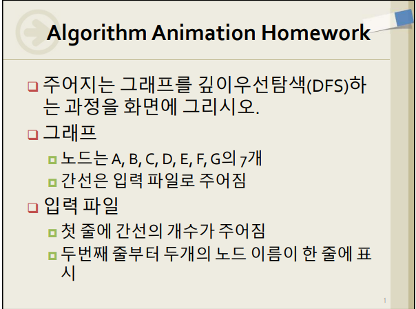
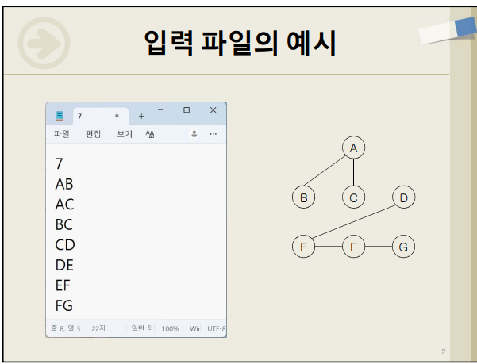
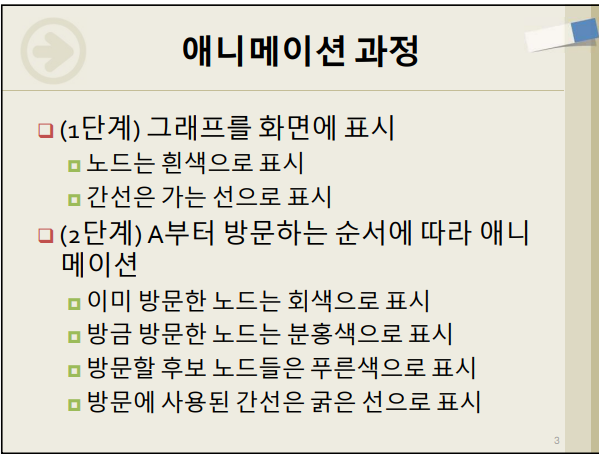
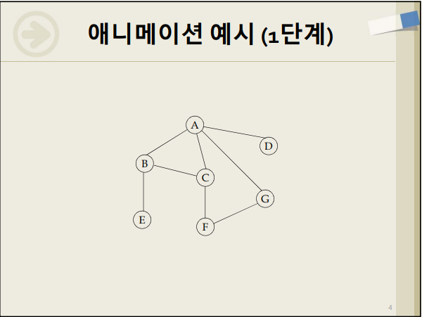
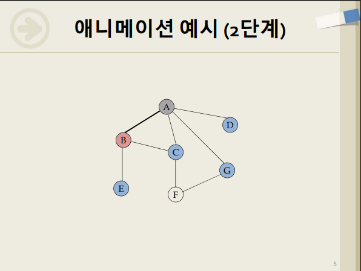
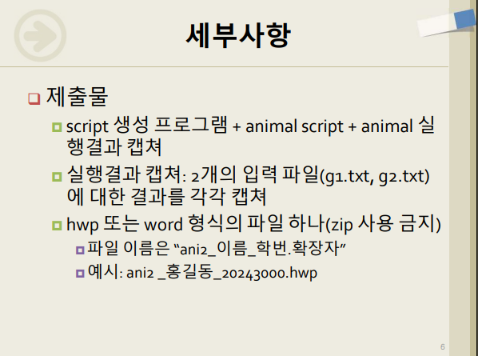
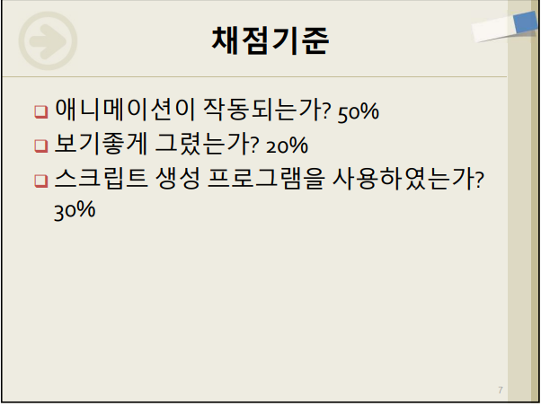

# DFS AnimalScript Generator Assignment

고정된 7개 노드 `A, B, C, D, E, F, G`로 구성된 무방향 그래프를 입력 파일에서 읽고, `A`부터 깊이 우선 탐색(DFS)을 수행한 뒤 DFS 방문 과정을 AnimalScript(`.asu`)로 자동 생성하는 과제용 레포입니다.

이 레포는 직접 손으로 작성한 AnimalScript만 제출하는 구조가 아니라, 입력 파일을 읽어 AnimalScript를 생성하는 Python 프로그램을 포함합니다. 규모가 작은 과제이므로 이 레포에서는 README가 구현 설명 및 정리 문서 역할을 합니다.

## 과제 요구사항

주어진 그래프를 깊이우선탐색(DFS)하는 과정을 화면에 그리는 과제입니다.

- 노드는 `A, B, C, D, E, F, G` 총 7개입니다.
- 간선은 입력 파일로 제공됩니다.
- 입력 파일 첫 줄은 간선 개수입니다.
- 두 번째 줄부터는 두 노드 이름이 한 줄에 표시됩니다.
- DFS 시작 노드는 `A`입니다.
- 인접 노드는 알파벳순으로 방문합니다.
- 그래프는 무방향 그래프로 처리합니다.

1단계는 그래프를 화면에 표시합니다.

- 노드는 흰색으로 표시합니다.
- 간선은 가는 선으로 표시합니다.

2단계는 `A`부터 방문하는 DFS 순서에 따라 애니메이션합니다.

- 이미 방문한 노드는 회색으로 표시합니다.
- 방금 방문한 노드는 분홍색으로 표시합니다.
- 방문 후보 노드는 푸른색으로 표시합니다.
- 방문에 사용된 간선은 굵은 선으로 표시합니다.

제출물:

- script 생성 프로그램
- animal script
- animal 실행 결과 캡처
- `g1.txt`, `g2.txt` 각각의 실행 결과 캡처
- hwp 또는 word 형식 파일 하나
- zip 사용 금지

채점 기준:

- 애니메이션 작동 여부 50%
- 보기 좋게 그렸는가 20%
- 스크립트 생성 프로그램 사용 여부 30%

## 과제 안내 이미지

아래 이미지는 과제 안내 자료입니다. Animal 실행 결과 캡처가 아니라 과제 요구사항을 정리하기 위한 참고 이미지입니다.

<table>
  <tr>
    <td align="center">
      <br>
      <sub>과제 개요</sub>
    </td>
    <td align="center">
      <br>
      <sub>입력 파일 예시</sub>
    </td>
  </tr>
  <tr>
    <td align="center">
      <br>
      <sub>애니메이션 과정</sub>
    </td>
    <td align="center">
      <br>
      <sub>애니메이션 예시 1단계</sub>
    </td>
  </tr>
  <tr>
    <td align="center">
      <br>
      <sub>애니메이션 예시 2단계</sub>
    </td>
    <td align="center">
      <br>
      <sub>세부사항 및 제출물</sub>
    </td>
  </tr>
  <tr>
    <td align="center">
      <br>
      <sub>채점기준</sub>
    </td>
  </tr>
</table>

## 레포 목적

- `input/g1.txt`, `input/g2.txt` 그래프 입력 파일을 유지합니다.
- `src/dfs_animal_generator.py`가 입력 그래프를 검증하고 DFS를 수행합니다.
- 생성 프로그램이 `output/g1.asu`, `output/g2.asu` AnimalScript 파일을 만듭니다.
- README를 중심으로 과제 요구사항, 구현 설명, 실행 방법을 정리합니다.
- 실제 LMS 제출 시에는 과제 요구사항에 따라 생성 프로그램, AnimalScript, Animal 실행 캡처를 Word/HWP 하나에 정리해야 합니다.

## 레포 구조

```text
README.md
input/
  g1.txt
  g2.txt
src/
  dfs_animal_generator.py
output/
  .gitkeep
  g1.asu
  g2.asu
screenshots/
  .gitkeep
  assignment_01_overview.png
  assignment_02_input_example.png
  assignment_03_animation_process.png
  assignment_04_initial_graph.png
  assignment_05_dfs_step.png
  assignment_06_submission_details.png
  assignment_07_grading_criteria.png
```

## 입력 파일 형식

입력 파일 첫 줄에는 간선 개수를 적습니다.

두 번째 줄부터는 무방향 간선을 한 줄에 하나씩 적습니다. 간선은 `AB`, `AC`처럼 노드 문자 2개로 작성합니다.

```text
7
AB
AD
BC
CD
BE
EF
FG
```

조건:

- 허용 노드는 `A`부터 `G`까지입니다.
- 자기 자신으로 가는 간선은 허용하지 않습니다.
- 중복 간선은 안전하게 무시합니다.
- 인접 노드는 알파벳순으로 방문합니다.
- DFS 시작 노드는 항상 `A`입니다.

## 실행 방법

```bash
python src/dfs_animal_generator.py input/g1.txt output/g1.asu
python src/dfs_animal_generator.py input/g2.txt output/g2.asu
```

## g1/g2 예상 DFS 방문 순서

- `g1`: `A -> B -> C -> D -> E -> F -> G`
- `g2`: `A -> B -> C -> D -> G -> F -> E`

## AnimalScript 생성 방법

생성기는 입력 파일을 읽고 다음 작업을 수행합니다.

1. 첫 줄의 간선 개수와 실제 간선 줄 수를 검증합니다.
2. 간선 형식, 허용 노드, 자기 간선을 검증합니다.
3. 무방향 인접 리스트를 만듭니다.
4. 인접 노드를 알파벳순으로 정렬해 `A`부터 DFS를 수행합니다.
5. DFS 방문 순서와 DFS tree edge를 콘솔에 출력합니다.
6. 각 DFS 단계가 `nextStep`으로 나뉜 AnimalScript 파일을 생성합니다.

생성된 애니메이션은 제목, 그래프 영역, 현재 단계 설명, 방문 순서, DFS stack, 후보 노드, 색상 범례, DFS tree edge 강조를 포함합니다.

## Animal에서 .asu 실행 후 캡처하는 방법

1. Animal을 실행합니다.
2. `File` 메뉴에서 생성된 `.asu` 파일을 엽니다.
3. `output/g1.asu`, `output/g2.asu`를 각각 실행해 DFS 애니메이션이 단계별로 보이는지 확인합니다.
4. 필요한 실행 화면을 캡처합니다.
5. 캡처 이미지는 과제 안내 이미지와 구분되는 파일명으로 `screenshots/` 폴더에 추가할 수 있습니다.

## 최종 제출물 정리 방법

이 레포에서는 README가 구현 설명 및 정리 문서 역할을 합니다.

실제 LMS 제출 시에는 과제 요구사항에 따라 script 생성 프로그램, AnimalScript, `g1.txt`와 `g2.txt` 각각의 Animal 실행 캡처를 Word/HWP 하나에 정리해야 합니다.

zip 파일은 사용하지 않습니다.
