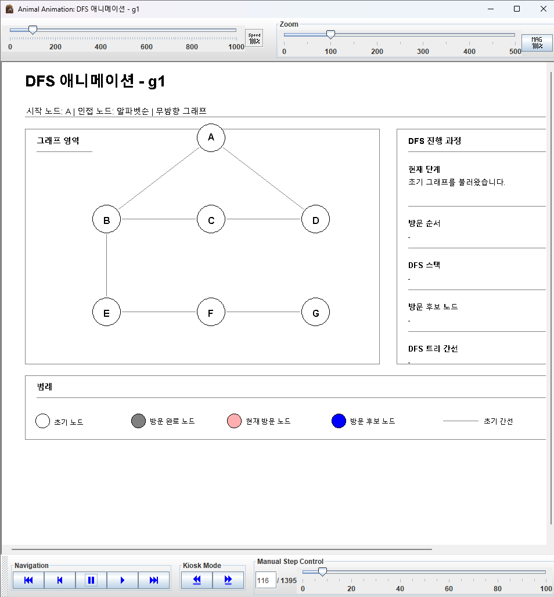
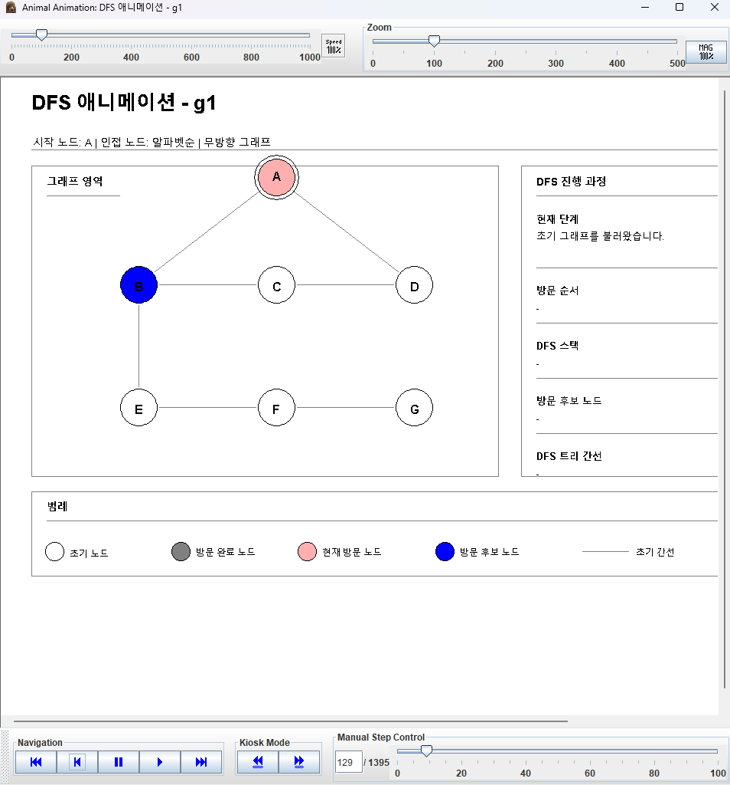
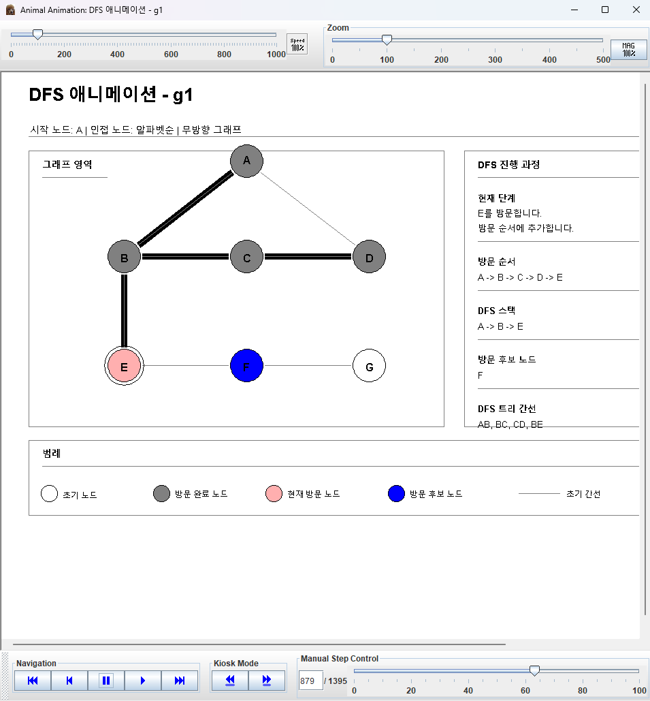
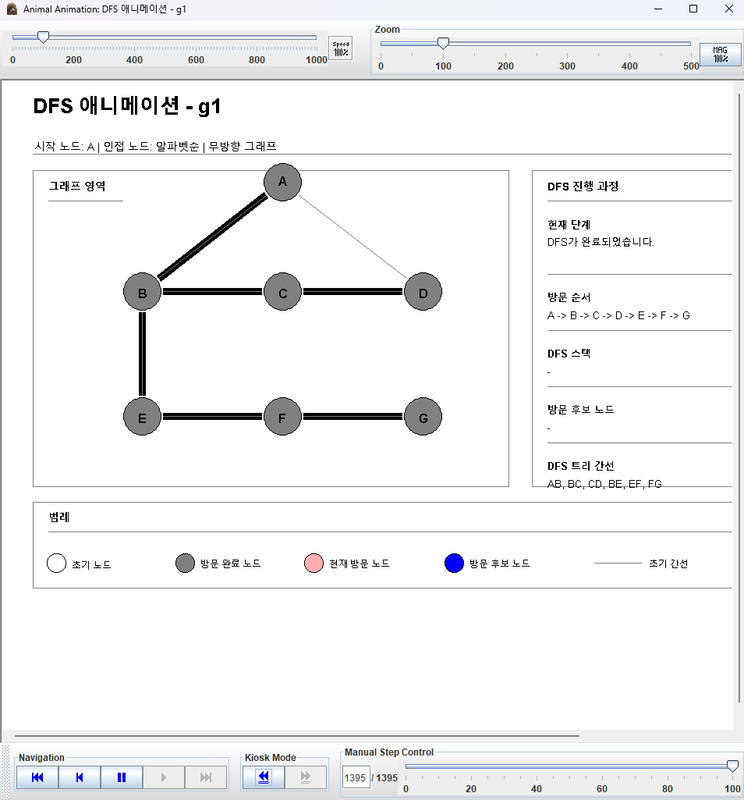
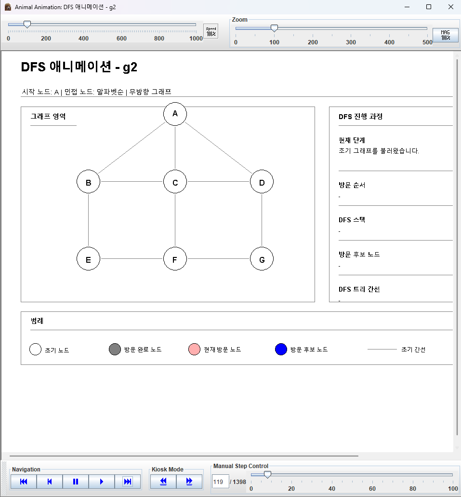
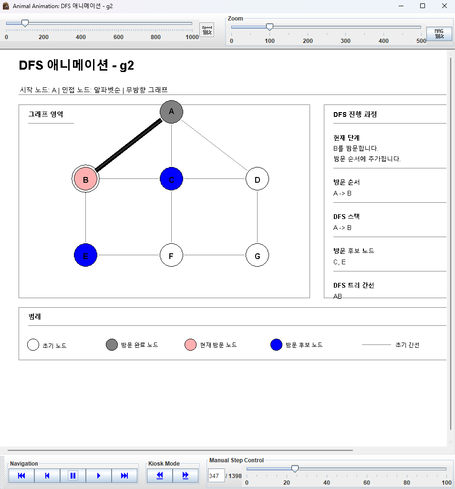
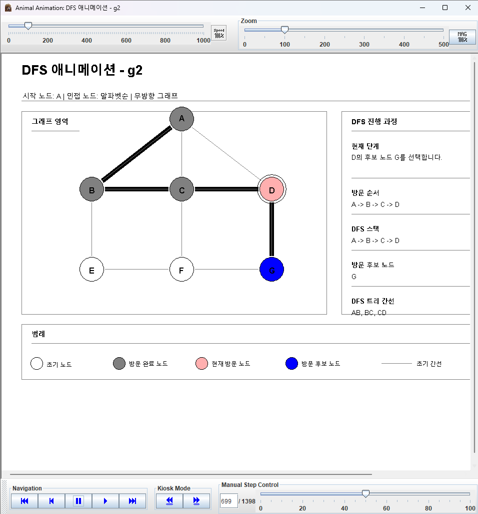
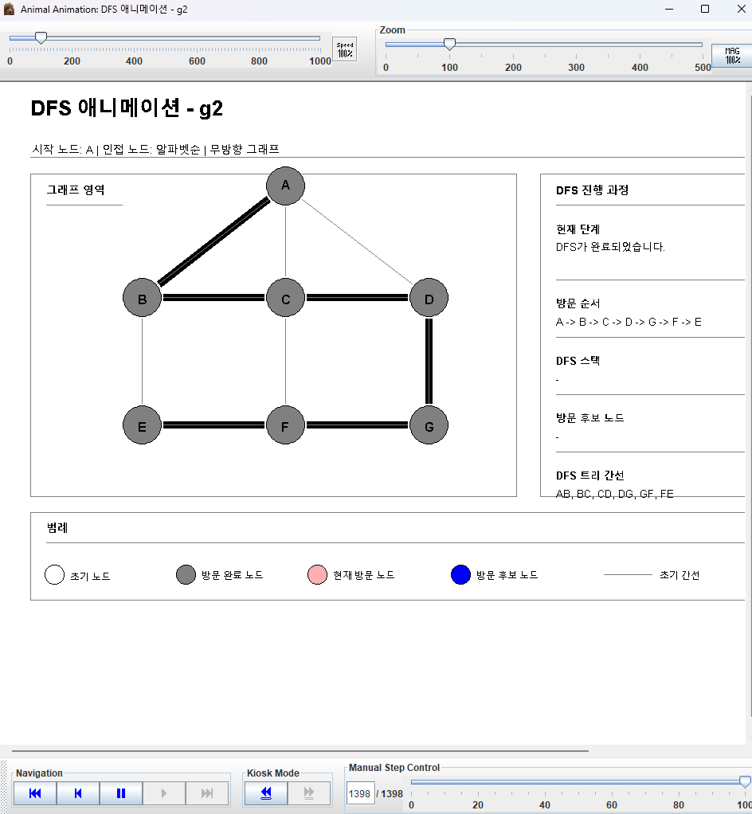

# DFS AnimalScript Generator Assignment

## 목차

- [1. 과제 개요](#1-과제-개요)
- [2. 과제 요구사항](#2-과제-요구사항)
- [3. 입력 파일](#3-입력-파일)
- [4. DFS 수행 결과](#4-dfs-수행-결과)
- [5. Animal 실행 결과](#5-animal-실행-결과)
- [6. script 생성 프로그램](#6-script-생성-프로그램)
- [부록 A. g1 AnimalScript](#부록-a-g1-animalscript)
- [부록 B. g2 AnimalScript](#부록-b-g2-animalscript)

## 1. 과제 개요

본 과제는 주어진 무방향 그래프를 깊이우선탐색(DFS)으로 탐색하는 과정을 AnimalScript 애니메이션으로 표현한 결과이다. 그래프의 노드는 `A, B, C, D, E, F, G` 총 7개로 고정하고, 간선은 입력 파일에서 읽어 구성한다.

DFS는 시작 노드 `A`에서 출발한다. 인접 노드는 알파벳순으로 방문한다. 각 단계에서는 초기 노드, 방문 완료 노드, 현재 방문 노드, 방문 후보 노드를 색상으로 구분하고, DFS 방문에 사용된 간선은 굵은 검은색 선으로 강조한다.

script 생성 프로그램은 입력 파일을 읽어 DFS를 수행하고 AnimalScript를 생성한다. 생성된 AnimalScript는 `g1`, `g2` 입력 그래프 각각에 대해 단계별 DFS 애니메이션을 표시한다.

## 2. 과제 요구사항

과제 요구사항은 다음과 같다.

- 노드는 `A, B, C, D, E, F, G` 총 7개이다.
- 간선은 입력 파일로 제공한다.
- 입력 파일 첫 줄은 간선 개수이다.
- 두 번째 줄부터는 두 노드 이름이 한 줄에 표시된다.
- 초기 화면에서는 노드를 흰색으로 표시하고, 간선을 가는 선으로 표시한다.
- DFS 애니메이션에서는 방문 완료 노드를 회색으로 표시한다.
- DFS 애니메이션에서는 현재 방문 노드를 분홍색으로 표시한다.
- DFS 애니메이션에서는 방문 후보 노드를 푸른색으로 표시한다.
- DFS 방문에 사용된 간선은 굵은 선으로 표시한다.
- 제출물은 script 생성 프로그램, animal script, animal 실행 결과 캡처를 포함한다.
- 제출 형식은 hwp 또는 word 형식 파일 하나이다.
- zip 사용은 금지이다.

채점 기준은 다음과 같다.

- 애니메이션 작동 여부 50%
- 보기 좋게 그렸는가 20%
- 스크립트 생성 프로그램 사용 여부 30%

## 3. 입력 파일

`g1.txt`는 간선 7개를 가진 무방향 그래프이다.

```text
7
AB
AD
BC
CD
BE
EF
FG
```

`g2.txt`는 간선 10개를 가진 무방향 그래프이다.

```text
10
AB
AC
AD
BC
CD
BE
CF
DG
EF
FG
```

두 입력 파일 모두 노드 `A`부터 `G`까지만 사용한다. 각 간선은 `AB`, `AC`와 같이 두 노드 문자로 표현한다.

## 4. DFS 수행 결과

DFS 수행 결과는 다음과 같다.

| 입력 파일 | DFS 방문 순서 | DFS tree edges |
| --- | --- | --- |
| `g1.txt` | `A -> B -> C -> D -> E -> F -> G` | `AB, BC, CD, BE, EF, FG` |
| `g2.txt` | `A -> B -> C -> D -> G -> F -> E` | `AB, BC, CD, DG, GF, FE` |

그래프는 무방향 그래프이다. 따라서 `g2`의 `GF`, `FE`는 각각 입력 간선 `FG`, `EF`를 DFS 진행 방향 기준으로 표시한 것이다.

## 5. Animal 실행 결과

다음 이미지는 Animal에서 생성된 `.asu` 파일을 실행한 결과이다.

### g1 실행 결과



*g1 초기 그래프*



*g1 시작 노드와 후보 노드 표시*



*g1 중간 DFS 진행 단계*



*g1 DFS 완료*

### g2 실행 결과



*g2 초기 그래프*



*g2 시작 노드와 후보 노드 표시*



*g2 중간 DFS 진행 단계*



*g2 DFS 완료*

## 6. script 생성 프로그램

```python
#!/usr/bin/env python3
"""Generate AnimalScript animation files for DFS on fixed A-G graphs."""

from __future__ import annotations

import math
import sys
from pathlib import Path


NODES = tuple("ABCDEFG")
START_NODE = "A"
NODE_RADIUS = 24
CURRENT_HALO_RADII = (NODE_RADIUS + 5,)

NODE_POSITIONS = {
    "A": (360, 130),
    "B": (180, 270),
    "C": (360, 270),
    "D": (540, 270),
    "E": (180, 430),
    "F": (360, 430),
    "G": (540, 430),
}

COLORS = {
    "white": "white",
    "black": "black",
    "edge_gray": "gray",
    "visited_gray": "gray",
    "current_pink": "pink",
    "candidate_blue": "blue",
    "tree_edge": "black",
    "panel_fill": "white",
    "green": "green",
}

NODE_STATE_FILLS = {
    "initial": "white",
    "visited": "visited_gray",
    "current": "current_pink",
    "candidate": "candidate_blue",
}


class InputError(ValueError):
    """Raised when the graph input file is invalid."""


def color(name: str) -> str:
    """Return an AnimalScript named color literal."""
    return COLORS[name]


def animal_text(value: str) -> str:
    """Escape text for an AnimalScript quoted string."""
    return value.replace("\\", "\\\\").replace('"', '\\"')


def normalize_edge(edge: str) -> tuple[str, str]:
    left, right = edge[0], edge[1]
    return tuple(sorted((left, right)))


def edge_id(left: str, right: str) -> str:
    first, second = sorted((left, right))
    return f"{first}{second}"


def parse_graph(input_path: Path) -> tuple[dict[str, list[str]], list[tuple[str, str]], list[str]]:
    if not input_path.exists():
        raise InputError(f"입력 파일을 찾을 수 없습니다: {input_path}")

    raw_lines = input_path.read_text(encoding="utf-8").splitlines()
    if not raw_lines:
        raise InputError("입력 파일이 비어 있습니다.")

    count_line = raw_lines[0].strip()
    if not count_line.isdigit():
        raise InputError("첫 줄에는 0 이상의 간선 개수를 숫자로 입력해야 합니다.")

    expected_count = int(count_line)
    edge_lines = [line.strip() for line in raw_lines[1:] if line.strip()]
    if len(edge_lines) != expected_count:
        raise InputError(
            f"간선 개수가 일치하지 않습니다: 첫 줄={expected_count}, 실제={len(edge_lines)}"
        )

    adjacency = {node: set() for node in NODES}
    unique_edges: list[tuple[str, str]] = []
    seen_edges: set[tuple[str, str]] = set()
    warnings: list[str] = []

    for line_number, edge in enumerate(edge_lines, start=2):
        if len(edge) != 2:
            raise InputError(f"{line_number}번째 줄의 간선 형식이 잘못되었습니다: {edge}")

        left, right = edge[0], edge[1]
        if left not in NODES or right not in NODES:
            raise InputError(
                f"{line_number}번째 줄의 노드가 허용 범위를 벗어났습니다: {edge}"
            )
        if left == right:
            raise InputError(f"{line_number}번째 줄의 자기 간선은 허용되지 않습니다: {edge}")

        normalized = normalize_edge(edge)
        if normalized in seen_edges:
            warnings.append(
                f"중복 간선을 무시했습니다: {normalized[0]}{normalized[1]} "
                f"(입력 {line_number}번째 줄)"
            )
            continue

        seen_edges.add(normalized)
        unique_edges.append(normalized)
        first, second = normalized
        adjacency[first].add(second)
        adjacency[second].add(first)

    sorted_adjacency = {node: sorted(neighbors) for node, neighbors in adjacency.items()}
    unique_edges.sort()
    return sorted_adjacency, unique_edges, warnings


def trace_dfs(adjacency: dict[str, list[str]]) -> tuple[list[str], list[tuple[str, str]], list[dict]]:
    visited: set[str] = set()
    visit_order: list[str] = []
    tree_edges: list[tuple[str, str]] = []
    events: list[dict] = []
    stack: list[str] = []

    def current_candidates(node: str) -> list[str]:
        return [neighbor for neighbor in adjacency[node] if neighbor not in visited]

    def snapshot(
        event_type: str,
        description: str,
        current: str | None = None,
        candidates: list[str] | None = None,
        selected_candidate: str | None = None,
        new_tree_edge: tuple[str, str] | None = None,
    ) -> None:
        events.append(
            {
                "type": event_type,
                "description": description,
                "current": current,
                "visited": list(visit_order),
                "stack": list(stack),
                "candidates": list(candidates or []),
                "selected_candidate": selected_candidate,
                "tree_edges": list(tree_edges),
                "new_tree_edge": new_tree_edge,
            }
        )

    def dfs(node: str) -> None:
        visited.add(node)
        visit_order.append(node)
        stack.append(node)
        candidates = current_candidates(node)
        snapshot(
            "visit",
            f"{node}를 방문합니다. 방문 순서에 추가합니다.",
            current=node,
            candidates=candidates,
        )

        for neighbor in adjacency[node]:
            if neighbor in visited:
                continue

            remaining_candidates = current_candidates(node)
            snapshot(
                "candidate",
                f"{node}의 후보 노드 {neighbor}를 선택합니다.",
                current=node,
                candidates=remaining_candidates,
                selected_candidate=neighbor,
            )

            new_edge = (node, neighbor)
            tree_edges.append(new_edge)
            snapshot(
                "tree_edge",
                f"{node}에서 {neighbor}로 이동합니다. DFS 트리 간선 {node}{neighbor}를 표시합니다.",
                current=node,
                candidates=[neighbor],
                selected_candidate=neighbor,
                new_tree_edge=new_edge,
            )
            dfs(neighbor)

        stack.pop()
        if stack:
            parent = stack[-1]
            snapshot(
                "backtrack",
                f"{node}의 인접 노드 처리를 완료했습니다. {parent}로 되돌아갑니다.",
                current=parent,
                candidates=current_candidates(parent),
            )
        else:
            snapshot(
                "complete",
                "DFS가 완료되었습니다.",
                current=None,
                candidates=[],
            )

    dfs(START_NODE)
    return visit_order, tree_edges, events


def shortened_line_points(
    start: tuple[int, int],
    end: tuple[int, int],
    inset: int = NODE_RADIUS + 3,
) -> tuple[tuple[float, float], tuple[float, float]]:
    x1, y1 = start
    x2, y2 = end
    dx = x2 - x1
    dy = y2 - y1
    distance = math.hypot(dx, dy)
    if distance == 0:
        return start, end
    ux = dx / distance
    uy = dy / distance
    return (x1 + ux * inset, y1 + uy * inset), (x2 - ux * inset, y2 - uy * inset)


def offset_points(
    start: tuple[float, float],
    end: tuple[float, float],
    offset: int,
) -> tuple[tuple[int, int], tuple[int, int]]:
    x1, y1 = start
    x2, y2 = end
    dx = x2 - x1
    dy = y2 - y1
    distance = math.hypot(dx, dy)
    if distance == 0:
        return (round(x1), round(y1)), (round(x2), round(y2))
    nx = -dy / distance
    ny = dx / distance
    return (
        (round(x1 + nx * offset), round(y1 + ny * offset)),
        (round(x2 + nx * offset), round(y2 + ny * offset)),
    )


def thick_line_polygon_points(
    start: tuple[float, float],
    end: tuple[float, float],
    half_width: int = 4,
) -> list[tuple[int, int]]:
    left_start, left_end = offset_points(start, end, half_width)
    right_start, right_end = offset_points(start, end, -half_width)
    return [left_start, left_end, right_end, right_start]


def point(value: tuple[int, int] | tuple[float, float]) -> str:
    x, y = value
    return f"({round(x)}, {round(y)})"


def emit_set_text(name: str, value: str) -> str:
    return f'setText "{name}" "{animal_text(value)}"'


def split_step_description(description: str) -> tuple[str, str]:
    if ". " in description:
        first, second = description.split(". ", 1)
        return first + ".", second

    if len(description) <= 28:
        return description, " "

    split_at = description.rfind(" ", 0, 28)
    if split_at == -1:
        split_at = 28
    return description[:split_at], description[split_at:].strip()


def emit_node_state(event: dict) -> list[str]:
    visited = set(event["visited"])
    candidates = set(event["candidates"])
    current = event["current"]
    selected_candidate = event["selected_candidate"]
    lines: list[str] = []

    for node in NODES:
        if node == current:
            state = "current"
        elif node == selected_candidate or (node in candidates and node not in visited):
            state = "candidate"
        elif node in visited:
            state = "visited"
        else:
            state = "initial"

        for state_name in NODE_STATE_FILLS:
            lines.append(f'hide "node_{node}_{state_name}"')
        for index, _radius in enumerate(CURRENT_HALO_RADII, start=1):
            lines.append(f'hide "node_{node}_current_ring_{index}"')
        lines.append(f'show "node_{node}_{state}"')
        if state == "current":
            for index, _radius in enumerate(CURRENT_HALO_RADII, start=1):
                lines.append(f'show "node_{node}_current_ring_{index}"')

    return lines


def emit_tree_edge(edge: tuple[str, str]) -> list[str]:
    left, right = edge
    edge_name = edge_id(left, right)
    start, end = shortened_line_points(NODE_POSITIONS[left], NODE_POSITIONS[right])
    polygon_points = " ".join(point(value) for value in thick_line_polygon_points(start, end))
    return [
        f"# 굵은 DFS 트리 간선 {left}{right}",
        f'polygon "tree_{edge_name}" {polygon_points} color {color("tree_edge")} '
        f'filled fillColor {color("tree_edge")} depth 1',
    ]


def emit_base_layout(title: str, edges: list[tuple[str, str]]) -> list[str]:
    lines = [
        "%Animal 2",
        f'title "{animal_text(title)}"',
        'author "DFS AnimalScript Generator"',
        "stepMode true",
        "",
        f'text "title" "{animal_text(title)}" (40, 24) color {color("black")} font SansSerif size 26 bold',
        f'text "subtitle" "시작 노드: A | 인접 노드: 알파벳순 | 무방향 그래프" (42, 61) color {color("black")} font SansSerif size 14',
        f'polyline "title_rule" (40, 94) (1080, 94) color {color("edge_gray")} depth 3',
        "",
        f'rect "graph_panel" (40, 115) (650, 520) color {color("edge_gray")} filled fillColor {color("panel_fill")} depth 8',
        f'text "graph_label" "그래프 영역" (60, 125) color {color("black")} font SansSerif size 14 bold',
        f'polyline "graph_header_rule" (60, 154) (155, 154) color {color("edge_gray")} depth 3',
        f'rect "info_panel" (680, 115) (1080, 520) color {color("edge_gray")} filled fillColor {color("panel_fill")} depth 8',
        f'text "info_label" "DFS 진행 과정" (700, 125) color {color("black")} font SansSerif size 14 bold',
        f'polyline "info_header_rule" (700, 154) (1060, 154) color {color("edge_gray")} depth 3',
        "",
        f'text "step_heading" "현재 단계" (700, 174) color {color("black")} font SansSerif size 13 bold',
        f'text "step_text_1" "초기 그래프를 불러왔습니다." (700, 197) color {color("black")} font SansSerif size 13',
        f'text "step_text_2" " " (700, 219) color {color("black")} font SansSerif size 13',
        f'polyline "info_rule_step" (700, 248) (1060, 248) color {color("edge_gray")} depth 3',
        f'text "order_heading" "방문 순서" (700, 268) color {color("black")} font SansSerif size 13 bold',
        f'text "order_text" "-" (700, 291) color {color("black")} font SansSerif size 13',
        f'polyline "info_rule_order" (700, 320) (1060, 320) color {color("edge_gray")} depth 3',
        f'text "stack_heading" "DFS 스택" (700, 340) color {color("black")} font SansSerif size 13 bold',
        f'text "stack_text" "-" (700, 363) color {color("black")} font SansSerif size 13',
        f'polyline "info_rule_stack" (700, 392) (1060, 392) color {color("edge_gray")} depth 3',
        f'text "candidate_heading" "방문 후보 노드" (700, 412) color {color("black")} font SansSerif size 13 bold',
        f'text "candidate_text" "-" (700, 435) color {color("black")} font SansSerif size 13',
        f'polyline "info_rule_candidate" (700, 464) (1060, 464) color {color("edge_gray")} depth 3',
        f'text "tree_heading" "DFS 트리 간선" (700, 484) color {color("black")} font SansSerif size 13 bold',
        f'text "tree_text" "-" (700, 507) color {color("black")} font SansSerif size 13',
        "",
        f'rect "legend_panel" (40, 540) (1080, 650) color {color("edge_gray")} filled fillColor {color("panel_fill")} depth 8',
        f'text "legend_title" "범례" (60, 550) color {color("black")} font SansSerif size 14 bold',
        f'polyline "legend_header_rule" (60, 578) (1060, 578) color {color("edge_gray")} depth 3',
    ]

    legend_items = [
        ("legend_initial", "초기 노드", "white", 70, 618),
        ("legend_visited", "방문 완료 노드", "visited_gray", 235, 618),
        ("legend_current", "현재 방문 노드", "current_pink", 400, 618),
        ("legend_candidate", "방문 후보 노드", "candidate_blue", 580, 618),
    ]
    for name, label, fill, x, y in legend_items:
        lines.extend(
            [
                f'circle "{name}" ({x}, {y}) radius 12 color {color("black")} filled fillColor {color(fill)} depth 2',
                f'text "{name}_text" "{label}" ({x + 20}, {y - 8}) color {color("black")} font SansSerif size 12',
            ]
        )

    lines.extend(
        [
            f'polyline "legend_edge" (760, 618) (820, 618) color {color("edge_gray")} depth 3',
            f'text "legend_edge_text" "초기 간선" (830, 610) color {color("black")} font SansSerif size 12',
            f'rect "legend_tree" (940, 614) (1000, 622) color {color("tree_edge")} filled fillColor {color("tree_edge")} depth 1',
            f'text "legend_tree_text" "DFS 트리 간선" (1010, 610) color {color("black")} font SansSerif size 12',
            "",
            "# 기본 그래프 간선",
        ]
    )

    for left, right in edges:
        start, end = shortened_line_points(NODE_POSITIONS[left], NODE_POSITIONS[right])
        lines.append(
            f'polyline "edge_{edge_id(left, right)}" {point(start)} {point(end)} '
            f'color {color("edge_gray")} depth 5'
        )

    lines.extend(["", "# 그래프 노드"])
    for node in NODES:
        x, y = NODE_POSITIONS[node]
        for state_name, fill in NODE_STATE_FILLS.items():
            lines.append(
                f'circle "node_{node}_{state_name}" ({x}, {y}) radius {NODE_RADIUS} '
                f'color {color("black")} filled fillColor {color(fill)} depth 2'
            )
            if state_name != "initial":
                lines.append(f'hide "node_{node}_{state_name}"')
        for index, radius in enumerate(CURRENT_HALO_RADII, start=1):
            lines.append(
                f'circle "node_{node}_current_ring_{index}" ({x}, {y}) radius {radius} '
                f'color {color("black")} depth 1'
            )
            lines.append(f'hide "node_{node}_current_ring_{index}"')
        lines.append(
            f'text "label_{node}" "{node}" ({x - 5}, {y - 9}) '
            f'color {color("black")} font SansSerif size 16 bold depth 1'
        )

    lines.extend(["", 'nextStep "초기 그래프"'])
    return lines


def format_order(nodes: list[str]) -> str:
    return " -> ".join(nodes) if nodes else "-"


def format_edges(edges: list[tuple[str, str]]) -> str:
    return ", ".join(f"{left}{right}" for left, right in edges) if edges else "-"


def emit_event(event: dict, index: int) -> list[str]:
    step_line_1, step_line_2 = split_step_description(event["description"])
    lines = [
        "",
        f"# Step {index}: {event['type']}",
    ]
    new_tree_edge = event.get("new_tree_edge")
    if new_tree_edge:
        lines.extend(emit_tree_edge(new_tree_edge))

    lines.extend(emit_node_state(event))
    lines.extend(
        [
            emit_set_text("step_text_1", step_line_1),
            emit_set_text("step_text_2", step_line_2),
            emit_set_text("order_text", format_order(event["visited"])),
            emit_set_text("stack_text", format_order(event["stack"])),
            emit_set_text("candidate_text", ", ".join(event["candidates"]) if event["candidates"] else "-"),
            emit_set_text("tree_text", format_edges(event["tree_edges"])),
            f'nextStep "{animal_text(event["description"][:60])}"',
        ]
    )
    return lines


def generate_animalscript(
    title: str,
    edges: list[tuple[str, str]],
    events: list[dict],
) -> str:
    lines = emit_base_layout(title, edges)
    for index, event in enumerate(events, start=1):
        lines.extend(emit_event(event, index))
    lines.append("")
    return "\n".join(lines)


def write_animalscript(
    output_path: Path,
    input_path: Path,
    edges: list[tuple[str, str]],
    events: list[dict],
) -> None:
    title = f"DFS 애니메이션 - {input_path.stem}"
    script = generate_animalscript(title, edges, events)
    output_path.parent.mkdir(parents=True, exist_ok=True)
    output_path.write_text(script, encoding="utf-8")


def main(argv: list[str]) -> int:
    if len(argv) != 3:
        print(
            "Usage: python src/dfs_animal_generator.py <input-file> <output-file>",
            file=sys.stderr,
        )
        return 2

    input_path = Path(argv[1])
    output_path = Path(argv[2])

    try:
        adjacency, edges, warnings = parse_graph(input_path)
        visit_order, tree_edges, events = trace_dfs(adjacency)
        write_animalscript(output_path, input_path, edges, events)
    except InputError as exc:
        print(f"Error: {exc}", file=sys.stderr)
        return 1
    except OSError as exc:
        print(f"Error: 파일 처리 중 문제가 발생했습니다: {exc}", file=sys.stderr)
        return 1

    for warning in warnings:
        print(f"Warning: {warning}")

    print(f"DFS visit order: {format_order(visit_order)}")
    print(f"DFS tree edges: {format_edges(tree_edges)}")
    print(f"AnimalScript generated: {output_path}")
    return 0


if __name__ == "__main__":
    raise SystemExit(main(sys.argv))
```

## 부록 A. g1 AnimalScript

파일 경로: `output/g1.asu`

```text
%Animal 2
title "DFS 애니메이션 - g1"
author "DFS AnimalScript Generator"
stepMode true

text "title" "DFS 애니메이션 - g1" (40, 24) color black font SansSerif size 26 bold
text "subtitle" "시작 노드: A | 인접 노드: 알파벳순 | 무방향 그래프" (42, 61) color black font SansSerif size 14
polyline "title_rule" (40, 94) (1080, 94) color gray depth 3

rect "graph_panel" (40, 115) (650, 520) color gray filled fillColor white depth 8
text "graph_label" "그래프 영역" (60, 125) color black font SansSerif size 14 bold
polyline "graph_header_rule" (60, 154) (155, 154) color gray depth 3
rect "info_panel" (680, 115) (1080, 520) color gray filled fillColor white depth 8
text "info_label" "DFS 진행 과정" (700, 125) color black font SansSerif size 14 bold
polyline "info_header_rule" (700, 154) (1060, 154) color gray depth 3

text "step_heading" "현재 단계" (700, 174) color black font SansSerif size 13 bold
text "step_text_1" "초기 그래프를 불러왔습니다." (700, 197) color black font SansSerif size 13
text "step_text_2" " " (700, 219) color black font SansSerif size 13
polyline "info_rule_step" (700, 248) (1060, 248) color gray depth 3
text "order_heading" "방문 순서" (700, 268) color black font SansSerif size 13 bold
text "order_text" "-" (700, 291) color black font SansSerif size 13
polyline "info_rule_order" (700, 320) (1060, 320) color gray depth 3
text "stack_heading" "DFS 스택" (700, 340) color black font SansSerif size 13 bold
text "stack_text" "-" (700, 363) color black font SansSerif size 13
polyline "info_rule_stack" (700, 392) (1060, 392) color gray depth 3
text "candidate_heading" "방문 후보 노드" (700, 412) color black font SansSerif size 13 bold
text "candidate_text" "-" (700, 435) color black font SansSerif size 13
polyline "info_rule_candidate" (700, 464) (1060, 464) color gray depth 3
text "tree_heading" "DFS 트리 간선" (700, 484) color black font SansSerif size 13 bold
text "tree_text" "-" (700, 507) color black font SansSerif size 13

rect "legend_panel" (40, 540) (1080, 650) color gray filled fillColor white depth 8
text "legend_title" "범례" (60, 550) color black font SansSerif size 14 bold
polyline "legend_header_rule" (60, 578) (1060, 578) color gray depth 3
circle "legend_initial" (70, 618) radius 12 color black filled fillColor white depth 2
text "legend_initial_text" "초기 노드" (90, 610) color black font SansSerif size 12
circle "legend_visited" (235, 618) radius 12 color black filled fillColor gray depth 2
text "legend_visited_text" "방문 완료 노드" (255, 610) color black font SansSerif size 12
circle "legend_current" (400, 618) radius 12 color black filled fillColor pink depth 2
text "legend_current_text" "현재 방문 노드" (420, 610) color black font SansSerif size 12
circle "legend_candidate" (580, 618) radius 12 color black filled fillColor blue depth 2
text "legend_candidate_text" "방문 후보 노드" (600, 610) color black font SansSerif size 12
polyline "legend_edge" (760, 618) (820, 618) color gray depth 3
text "legend_edge_text" "초기 간선" (830, 610) color black font SansSerif size 12
rect "legend_tree" (940, 614) (1000, 622) color black filled fillColor black depth 1
text "legend_tree_text" "DFS 트리 간선" (1010, 610) color black font SansSerif size 12

# 기본 그래프 간선
polyline "edge_AB" (339, 147) (201, 253) color gray depth 5
polyline "edge_AD" (381, 147) (519, 253) color gray depth 5
polyline "edge_BC" (207, 270) (333, 270) color gray depth 5
polyline "edge_BE" (180, 297) (180, 403) color gray depth 5
polyline "edge_CD" (387, 270) (513, 270) color gray depth 5
polyline "edge_EF" (207, 430) (333, 430) color gray depth 5
polyline "edge_FG" (387, 430) (513, 430) color gray depth 5

# 그래프 노드
circle "node_A_initial" (360, 130) radius 24 color black filled fillColor white depth 2
circle "node_A_visited" (360, 130) radius 24 color black filled fillColor gray depth 2
hide "node_A_visited"
circle "node_A_current" (360, 130) radius 24 color black filled fillColor pink depth 2
hide "node_A_current"
circle "node_A_candidate" (360, 130) radius 24 color black filled fillColor blue depth 2
hide "node_A_candidate"
circle "node_A_current_ring_1" (360, 130) radius 29 color black depth 1
hide "node_A_current_ring_1"
text "label_A" "A" (355, 121) color black font SansSerif size 16 bold depth 1
circle "node_B_initial" (180, 270) radius 24 color black filled fillColor white depth 2
circle "node_B_visited" (180, 270) radius 24 color black filled fillColor gray depth 2
hide "node_B_visited"
circle "node_B_current" (180, 270) radius 24 color black filled fillColor pink depth 2
hide "node_B_current"
circle "node_B_candidate" (180, 270) radius 24 color black filled fillColor blue depth 2
hide "node_B_candidate"
circle "node_B_current_ring_1" (180, 270) radius 29 color black depth 1
hide "node_B_current_ring_1"
text "label_B" "B" (175, 261) color black font SansSerif size 16 bold depth 1
circle "node_C_initial" (360, 270) radius 24 color black filled fillColor white depth 2
circle "node_C_visited" (360, 270) radius 24 color black filled fillColor gray depth 2
hide "node_C_visited"
circle "node_C_current" (360, 270) radius 24 color black filled fillColor pink depth 2
hide "node_C_current"
circle "node_C_candidate" (360, 270) radius 24 color black filled fillColor blue depth 2
hide "node_C_candidate"
circle "node_C_current_ring_1" (360, 270) radius 29 color black depth 1
hide "node_C_current_ring_1"
text "label_C" "C" (355, 261) color black font SansSerif size 16 bold depth 1
circle "node_D_initial" (540, 270) radius 24 color black filled fillColor white depth 2
circle "node_D_visited" (540, 270) radius 24 color black filled fillColor gray depth 2
hide "node_D_visited"
circle "node_D_current" (540, 270) radius 24 color black filled fillColor pink depth 2
hide "node_D_current"
circle "node_D_candidate" (540, 270) radius 24 color black filled fillColor blue depth 2
hide "node_D_candidate"
circle "node_D_current_ring_1" (540, 270) radius 29 color black depth 1
hide "node_D_current_ring_1"
text "label_D" "D" (535, 261) color black font SansSerif size 16 bold depth 1
circle "node_E_initial" (180, 430) radius 24 color black filled fillColor white depth 2
circle "node_E_visited" (180, 430) radius 24 color black filled fillColor gray depth 2
hide "node_E_visited"
circle "node_E_current" (180, 430) radius 24 color black filled fillColor pink depth 2
hide "node_E_current"
circle "node_E_candidate" (180, 430) radius 24 color black filled fillColor blue depth 2
hide "node_E_candidate"
circle "node_E_current_ring_1" (180, 430) radius 29 color black depth 1
hide "node_E_current_ring_1"
text "label_E" "E" (175, 421) color black font SansSerif size 16 bold depth 1
circle "node_F_initial" (360, 430) radius 24 color black filled fillColor white depth 2
circle "node_F_visited" (360, 430) radius 24 color black filled fillColor gray depth 2
hide "node_F_visited"
circle "node_F_current" (360, 430) radius 24 color black filled fillColor pink depth 2
hide "node_F_current"
circle "node_F_candidate" (360, 430) radius 24 color black filled fillColor blue depth 2
hide "node_F_candidate"
circle "node_F_current_ring_1" (360, 430) radius 29 color black depth 1
hide "node_F_current_ring_1"
text "label_F" "F" (355, 421) color black font SansSerif size 16 bold depth 1
circle "node_G_initial" (540, 430) radius 24 color black filled fillColor white depth 2
circle "node_G_visited" (540, 430) radius 24 color black filled fillColor gray depth 2
hide "node_G_visited"
circle "node_G_current" (540, 430) radius 24 color black filled fillColor pink depth 2
hide "node_G_current"
circle "node_G_candidate" (540, 430) radius 24 color black filled fillColor blue depth 2
hide "node_G_candidate"
circle "node_G_current_ring_1" (540, 430) radius 29 color black depth 1
hide "node_G_current_ring_1"
text "label_G" "G" (535, 421) color black font SansSerif size 16 bold depth 1

nextStep "초기 그래프"

# Step 1: visit
hide "node_A_initial"
hide "node_A_visited"
hide "node_A_current"
hide "node_A_candidate"
hide "node_A_current_ring_1"
show "node_A_current"
show "node_A_current_ring_1"
hide "node_B_initial"
hide "node_B_visited"
hide "node_B_current"
hide "node_B_candidate"
hide "node_B_current_ring_1"
show "node_B_candidate"
hide "node_C_initial"
hide "node_C_visited"
hide "node_C_current"
hide "node_C_candidate"
hide "node_C_current_ring_1"
show "node_C_initial"
hide "node_D_initial"
hide "node_D_visited"
hide "node_D_current"
hide "node_D_candidate"
hide "node_D_current_ring_1"
show "node_D_candidate"
hide "node_E_initial"
hide "node_E_visited"
hide "node_E_current"
hide "node_E_candidate"
hide "node_E_current_ring_1"
show "node_E_initial"
hide "node_F_initial"
hide "node_F_visited"
hide "node_F_current"
hide "node_F_candidate"
hide "node_F_current_ring_1"
show "node_F_initial"
hide "node_G_initial"
hide "node_G_visited"
hide "node_G_current"
hide "node_G_candidate"
hide "node_G_current_ring_1"
show "node_G_initial"
setText "step_text_1" "A를 방문합니다."
setText "step_text_2" "방문 순서에 추가합니다."
setText "order_text" "A"
setText "stack_text" "A"
setText "candidate_text" "B, D"
setText "tree_text" "-"
nextStep "A를 방문합니다. 방문 순서에 추가합니다."

# Step 2: candidate
hide "node_A_initial"
hide "node_A_visited"
hide "node_A_current"
hide "node_A_candidate"
hide "node_A_current_ring_1"
show "node_A_current"
show "node_A_current_ring_1"
hide "node_B_initial"
hide "node_B_visited"
hide "node_B_current"
hide "node_B_candidate"
hide "node_B_current_ring_1"
show "node_B_candidate"
hide "node_C_initial"
hide "node_C_visited"
hide "node_C_current"
hide "node_C_candidate"
hide "node_C_current_ring_1"
show "node_C_initial"
hide "node_D_initial"
hide "node_D_visited"
hide "node_D_current"
hide "node_D_candidate"
hide "node_D_current_ring_1"
show "node_D_candidate"
hide "node_E_initial"
hide "node_E_visited"
hide "node_E_current"
hide "node_E_candidate"
hide "node_E_current_ring_1"
show "node_E_initial"
hide "node_F_initial"
hide "node_F_visited"
hide "node_F_current"
hide "node_F_candidate"
hide "node_F_current_ring_1"
show "node_F_initial"
hide "node_G_initial"
hide "node_G_visited"
hide "node_G_current"
hide "node_G_candidate"
hide "node_G_current_ring_1"
show "node_G_initial"
setText "step_text_1" "A의 후보 노드 B를 선택합니다."
setText "step_text_2" " "
setText "order_text" "A"
setText "stack_text" "A"
setText "candidate_text" "B, D"
setText "tree_text" "-"
nextStep "A의 후보 노드 B를 선택합니다."

# Step 3: tree_edge
# 굵은 DFS 트리 간선 AB
polygon "tree_AB" (336, 143) (199, 250) (204, 257) (341, 150) color black filled fillColor black depth 1
hide "node_A_initial"
hide "node_A_visited"
hide "node_A_current"
hide "node_A_candidate"
hide "node_A_current_ring_1"
show "node_A_current"
show "node_A_current_ring_1"
hide "node_B_initial"
hide "node_B_visited"
hide "node_B_current"
hide "node_B_candidate"
hide "node_B_current_ring_1"
show "node_B_candidate"
hide "node_C_initial"
hide "node_C_visited"
hide "node_C_current"
hide "node_C_candidate"
hide "node_C_current_ring_1"
show "node_C_initial"
hide "node_D_initial"
hide "node_D_visited"
hide "node_D_current"
hide "node_D_candidate"
hide "node_D_current_ring_1"
show "node_D_initial"
hide "node_E_initial"
hide "node_E_visited"
hide "node_E_current"
hide "node_E_candidate"
hide "node_E_current_ring_1"
show "node_E_initial"
hide "node_F_initial"
hide "node_F_visited"
hide "node_F_current"
hide "node_F_candidate"
hide "node_F_current_ring_1"
show "node_F_initial"
hide "node_G_initial"
hide "node_G_visited"
hide "node_G_current"
hide "node_G_candidate"
hide "node_G_current_ring_1"
show "node_G_initial"
setText "step_text_1" "A에서 B로 이동합니다."
setText "step_text_2" "DFS 트리 간선 AB를 표시합니다."
setText "order_text" "A"
setText "stack_text" "A"
setText "candidate_text" "B"
setText "tree_text" "AB"
nextStep "A에서 B로 이동합니다. DFS 트리 간선 AB를 표시합니다."

# Step 4: visit
hide "node_A_initial"
hide "node_A_visited"
hide "node_A_current"
hide "node_A_candidate"
hide "node_A_current_ring_1"
show "node_A_visited"
hide "node_B_initial"
hide "node_B_visited"
hide "node_B_current"
hide "node_B_candidate"
hide "node_B_current_ring_1"
show "node_B_current"
show "node_B_current_ring_1"
hide "node_C_initial"
hide "node_C_visited"
hide "node_C_current"
hide "node_C_candidate"
hide "node_C_current_ring_1"
show "node_C_candidate"
hide "node_D_initial"
hide "node_D_visited"
hide "node_D_current"
hide "node_D_candidate"
hide "node_D_current_ring_1"
show "node_D_initial"
hide "node_E_initial"
hide "node_E_visited"
hide "node_E_current"
hide "node_E_candidate"
hide "node_E_current_ring_1"
show "node_E_candidate"
hide "node_F_initial"
hide "node_F_visited"
hide "node_F_current"
hide "node_F_candidate"
hide "node_F_current_ring_1"
show "node_F_initial"
hide "node_G_initial"
hide "node_G_visited"
hide "node_G_current"
hide "node_G_candidate"
hide "node_G_current_ring_1"
show "node_G_initial"
setText "step_text_1" "B를 방문합니다."
setText "step_text_2" "방문 순서에 추가합니다."
setText "order_text" "A -> B"
setText "stack_text" "A -> B"
setText "candidate_text" "C, E"
setText "tree_text" "AB"
nextStep "B를 방문합니다. 방문 순서에 추가합니다."

# Step 5: candidate
hide "node_A_initial"
hide "node_A_visited"
hide "node_A_current"
hide "node_A_candidate"
hide "node_A_current_ring_1"
show "node_A_visited"
hide "node_B_initial"
hide "node_B_visited"
hide "node_B_current"
hide "node_B_candidate"
hide "node_B_current_ring_1"
show "node_B_current"
show "node_B_current_ring_1"
hide "node_C_initial"
hide "node_C_visited"
hide "node_C_current"
hide "node_C_candidate"
hide "node_C_current_ring_1"
show "node_C_candidate"
hide "node_D_initial"
hide "node_D_visited"
hide "node_D_current"
hide "node_D_candidate"
hide "node_D_current_ring_1"
show "node_D_initial"
hide "node_E_initial"
hide "node_E_visited"
hide "node_E_current"
hide "node_E_candidate"
hide "node_E_current_ring_1"
show "node_E_candidate"
hide "node_F_initial"
hide "node_F_visited"
hide "node_F_current"
hide "node_F_candidate"
hide "node_F_current_ring_1"
show "node_F_initial"
hide "node_G_initial"
hide "node_G_visited"
hide "node_G_current"
hide "node_G_candidate"
hide "node_G_current_ring_1"
show "node_G_initial"
setText "step_text_1" "B의 후보 노드 C를 선택합니다."
setText "step_text_2" " "
setText "order_text" "A -> B"
setText "stack_text" "A -> B"
setText "candidate_text" "C, E"
setText "tree_text" "AB"
nextStep "B의 후보 노드 C를 선택합니다."

# Step 6: tree_edge
# 굵은 DFS 트리 간선 BC
polygon "tree_BC" (207, 274) (333, 274) (333, 266) (207, 266) color black filled fillColor black depth 1
hide "node_A_initial"
hide "node_A_visited"
hide "node_A_current"
hide "node_A_candidate"
hide "node_A_current_ring_1"
show "node_A_visited"
hide "node_B_initial"
hide "node_B_visited"
hide "node_B_current"
hide "node_B_candidate"
hide "node_B_current_ring_1"
show "node_B_current"
show "node_B_current_ring_1"
hide "node_C_initial"
hide "node_C_visited"
hide "node_C_current"
hide "node_C_candidate"
hide "node_C_current_ring_1"
show "node_C_candidate"
hide "node_D_initial"
hide "node_D_visited"
hide "node_D_current"
hide "node_D_candidate"
hide "node_D_current_ring_1"
show "node_D_initial"
hide "node_E_initial"
hide "node_E_visited"
hide "node_E_current"
hide "node_E_candidate"
hide "node_E_current_ring_1"
show "node_E_initial"
hide "node_F_initial"
hide "node_F_visited"
hide "node_F_current"
hide "node_F_candidate"
hide "node_F_current_ring_1"
show "node_F_initial"
hide "node_G_initial"
hide "node_G_visited"
hide "node_G_current"
hide "node_G_candidate"
hide "node_G_current_ring_1"
show "node_G_initial"
setText "step_text_1" "B에서 C로 이동합니다."
setText "step_text_2" "DFS 트리 간선 BC를 표시합니다."
setText "order_text" "A -> B"
setText "stack_text" "A -> B"
setText "candidate_text" "C"
setText "tree_text" "AB, BC"
nextStep "B에서 C로 이동합니다. DFS 트리 간선 BC를 표시합니다."

# Step 7: visit
hide "node_A_initial"
hide "node_A_visited"
hide "node_A_current"
hide "node_A_candidate"
hide "node_A_current_ring_1"
show "node_A_visited"
hide "node_B_initial"
hide "node_B_visited"
hide "node_B_current"
hide "node_B_candidate"
hide "node_B_current_ring_1"
show "node_B_visited"
hide "node_C_initial"
hide "node_C_visited"
hide "node_C_current"
hide "node_C_candidate"
hide "node_C_current_ring_1"
show "node_C_current"
show "node_C_current_ring_1"
hide "node_D_initial"
hide "node_D_visited"
hide "node_D_current"
hide "node_D_candidate"
hide "node_D_current_ring_1"
show "node_D_candidate"
hide "node_E_initial"
hide "node_E_visited"
hide "node_E_current"
hide "node_E_candidate"
hide "node_E_current_ring_1"
show "node_E_initial"
hide "node_F_initial"
hide "node_F_visited"
hide "node_F_current"
hide "node_F_candidate"
hide "node_F_current_ring_1"
show "node_F_initial"
hide "node_G_initial"
hide "node_G_visited"
hide "node_G_current"
hide "node_G_candidate"
hide "node_G_current_ring_1"
show "node_G_initial"
setText "step_text_1" "C를 방문합니다."
setText "step_text_2" "방문 순서에 추가합니다."
setText "order_text" "A -> B -> C"
setText "stack_text" "A -> B -> C"
setText "candidate_text" "D"
setText "tree_text" "AB, BC"
nextStep "C를 방문합니다. 방문 순서에 추가합니다."

# Step 8: candidate
hide "node_A_initial"
hide "node_A_visited"
hide "node_A_current"
hide "node_A_candidate"
hide "node_A_current_ring_1"
show "node_A_visited"
hide "node_B_initial"
hide "node_B_visited"
hide "node_B_current"
hide "node_B_candidate"
hide "node_B_current_ring_1"
show "node_B_visited"
hide "node_C_initial"
hide "node_C_visited"
hide "node_C_current"
hide "node_C_candidate"
hide "node_C_current_ring_1"
show "node_C_current"
show "node_C_current_ring_1"
hide "node_D_initial"
hide "node_D_visited"
hide "node_D_current"
hide "node_D_candidate"
hide "node_D_current_ring_1"
show "node_D_candidate"
hide "node_E_initial"
hide "node_E_visited"
hide "node_E_current"
hide "node_E_candidate"
hide "node_E_current_ring_1"
show "node_E_initial"
hide "node_F_initial"
hide "node_F_visited"
hide "node_F_current"
hide "node_F_candidate"
hide "node_F_current_ring_1"
show "node_F_initial"
hide "node_G_initial"
hide "node_G_visited"
hide "node_G_current"
hide "node_G_candidate"
hide "node_G_current_ring_1"
show "node_G_initial"
setText "step_text_1" "C의 후보 노드 D를 선택합니다."
setText "step_text_2" " "
setText "order_text" "A -> B -> C"
setText "stack_text" "A -> B -> C"
setText "candidate_text" "D"
setText "tree_text" "AB, BC"
nextStep "C의 후보 노드 D를 선택합니다."

# Step 9: tree_edge
# 굵은 DFS 트리 간선 CD
polygon "tree_CD" (387, 274) (513, 274) (513, 266) (387, 266) color black filled fillColor black depth 1
hide "node_A_initial"
hide "node_A_visited"
hide "node_A_current"
hide "node_A_candidate"
hide "node_A_current_ring_1"
show "node_A_visited"
hide "node_B_initial"
hide "node_B_visited"
hide "node_B_current"
hide "node_B_candidate"
hide "node_B_current_ring_1"
show "node_B_visited"
hide "node_C_initial"
hide "node_C_visited"
hide "node_C_current"
hide "node_C_candidate"
hide "node_C_current_ring_1"
show "node_C_current"
show "node_C_current_ring_1"
hide "node_D_initial"
hide "node_D_visited"
hide "node_D_current"
hide "node_D_candidate"
hide "node_D_current_ring_1"
show "node_D_candidate"
hide "node_E_initial"
hide "node_E_visited"
hide "node_E_current"
hide "node_E_candidate"
hide "node_E_current_ring_1"
show "node_E_initial"
hide "node_F_initial"
hide "node_F_visited"
hide "node_F_current"
hide "node_F_candidate"
hide "node_F_current_ring_1"
show "node_F_initial"
hide "node_G_initial"
hide "node_G_visited"
hide "node_G_current"
hide "node_G_candidate"
hide "node_G_current_ring_1"
show "node_G_initial"
setText "step_text_1" "C에서 D로 이동합니다."
setText "step_text_2" "DFS 트리 간선 CD를 표시합니다."
setText "order_text" "A -> B -> C"
setText "stack_text" "A -> B -> C"
setText "candidate_text" "D"
setText "tree_text" "AB, BC, CD"
nextStep "C에서 D로 이동합니다. DFS 트리 간선 CD를 표시합니다."

# Step 10: visit
hide "node_A_initial"
hide "node_A_visited"
hide "node_A_current"
hide "node_A_candidate"
hide "node_A_current_ring_1"
show "node_A_visited"
hide "node_B_initial"
hide "node_B_visited"
hide "node_B_current"
hide "node_B_candidate"
hide "node_B_current_ring_1"
show "node_B_visited"
hide "node_C_initial"
hide "node_C_visited"
hide "node_C_current"
hide "node_C_candidate"
hide "node_C_current_ring_1"
show "node_C_visited"
hide "node_D_initial"
hide "node_D_visited"
hide "node_D_current"
hide "node_D_candidate"
hide "node_D_current_ring_1"
show "node_D_current"
show "node_D_current_ring_1"
hide "node_E_initial"
hide "node_E_visited"
hide "node_E_current"
hide "node_E_candidate"
hide "node_E_current_ring_1"
show "node_E_initial"
hide "node_F_initial"
hide "node_F_visited"
hide "node_F_current"
hide "node_F_candidate"
hide "node_F_current_ring_1"
show "node_F_initial"
hide "node_G_initial"
hide "node_G_visited"
hide "node_G_current"
hide "node_G_candidate"
hide "node_G_current_ring_1"
show "node_G_initial"
setText "step_text_1" "D를 방문합니다."
setText "step_text_2" "방문 순서에 추가합니다."
setText "order_text" "A -> B -> C -> D"
setText "stack_text" "A -> B -> C -> D"
setText "candidate_text" "-"
setText "tree_text" "AB, BC, CD"
nextStep "D를 방문합니다. 방문 순서에 추가합니다."

# Step 11: backtrack
hide "node_A_initial"
hide "node_A_visited"
hide "node_A_current"
hide "node_A_candidate"
hide "node_A_current_ring_1"
show "node_A_visited"
hide "node_B_initial"
hide "node_B_visited"
hide "node_B_current"
hide "node_B_candidate"
hide "node_B_current_ring_1"
show "node_B_visited"
hide "node_C_initial"
hide "node_C_visited"
hide "node_C_current"
hide "node_C_candidate"
hide "node_C_current_ring_1"
show "node_C_current"
show "node_C_current_ring_1"
hide "node_D_initial"
hide "node_D_visited"
hide "node_D_current"
hide "node_D_candidate"
hide "node_D_current_ring_1"
show "node_D_visited"
hide "node_E_initial"
hide "node_E_visited"
hide "node_E_current"
hide "node_E_candidate"
hide "node_E_current_ring_1"
show "node_E_initial"
hide "node_F_initial"
hide "node_F_visited"
hide "node_F_current"
hide "node_F_candidate"
hide "node_F_current_ring_1"
show "node_F_initial"
hide "node_G_initial"
hide "node_G_visited"
hide "node_G_current"
hide "node_G_candidate"
hide "node_G_current_ring_1"
show "node_G_initial"
setText "step_text_1" "D의 인접 노드 처리를 완료했습니다."
setText "step_text_2" "C로 되돌아갑니다."
setText "order_text" "A -> B -> C -> D"
setText "stack_text" "A -> B -> C"
setText "candidate_text" "-"
setText "tree_text" "AB, BC, CD"
nextStep "D의 인접 노드 처리를 완료했습니다. C로 되돌아갑니다."

# Step 12: backtrack
hide "node_A_initial"
hide "node_A_visited"
hide "node_A_current"
hide "node_A_candidate"
hide "node_A_current_ring_1"
show "node_A_visited"
hide "node_B_initial"
hide "node_B_visited"
hide "node_B_current"
hide "node_B_candidate"
hide "node_B_current_ring_1"
show "node_B_current"
show "node_B_current_ring_1"
hide "node_C_initial"
hide "node_C_visited"
hide "node_C_current"
hide "node_C_candidate"
hide "node_C_current_ring_1"
show "node_C_visited"
hide "node_D_initial"
hide "node_D_visited"
hide "node_D_current"
hide "node_D_candidate"
hide "node_D_current_ring_1"
show "node_D_visited"
hide "node_E_initial"
hide "node_E_visited"
hide "node_E_current"
hide "node_E_candidate"
hide "node_E_current_ring_1"
show "node_E_candidate"
hide "node_F_initial"
hide "node_F_visited"
hide "node_F_current"
hide "node_F_candidate"
hide "node_F_current_ring_1"
show "node_F_initial"
hide "node_G_initial"
hide "node_G_visited"
hide "node_G_current"
hide "node_G_candidate"
hide "node_G_current_ring_1"
show "node_G_initial"
setText "step_text_1" "C의 인접 노드 처리를 완료했습니다."
setText "step_text_2" "B로 되돌아갑니다."
setText "order_text" "A -> B -> C -> D"
setText "stack_text" "A -> B"
setText "candidate_text" "E"
setText "tree_text" "AB, BC, CD"
nextStep "C의 인접 노드 처리를 완료했습니다. B로 되돌아갑니다."

# Step 13: candidate
hide "node_A_initial"
hide "node_A_visited"
hide "node_A_current"
hide "node_A_candidate"
hide "node_A_current_ring_1"
show "node_A_visited"
hide "node_B_initial"
hide "node_B_visited"
hide "node_B_current"
hide "node_B_candidate"
hide "node_B_current_ring_1"
show "node_B_current"
show "node_B_current_ring_1"
hide "node_C_initial"
hide "node_C_visited"
hide "node_C_current"
hide "node_C_candidate"
hide "node_C_current_ring_1"
show "node_C_visited"
hide "node_D_initial"
hide "node_D_visited"
hide "node_D_current"
hide "node_D_candidate"
hide "node_D_current_ring_1"
show "node_D_visited"
hide "node_E_initial"
hide "node_E_visited"
hide "node_E_current"
hide "node_E_candidate"
hide "node_E_current_ring_1"
show "node_E_candidate"
hide "node_F_initial"
hide "node_F_visited"
hide "node_F_current"
hide "node_F_candidate"
hide "node_F_current_ring_1"
show "node_F_initial"
hide "node_G_initial"
hide "node_G_visited"
hide "node_G_current"
hide "node_G_candidate"
hide "node_G_current_ring_1"
show "node_G_initial"
setText "step_text_1" "B의 후보 노드 E를 선택합니다."
setText "step_text_2" " "
setText "order_text" "A -> B -> C -> D"
setText "stack_text" "A -> B"
setText "candidate_text" "E"
setText "tree_text" "AB, BC, CD"
nextStep "B의 후보 노드 E를 선택합니다."

# Step 14: tree_edge
# 굵은 DFS 트리 간선 BE
polygon "tree_BE" (176, 297) (176, 403) (184, 403) (184, 297) color black filled fillColor black depth 1
hide "node_A_initial"
hide "node_A_visited"
hide "node_A_current"
hide "node_A_candidate"
hide "node_A_current_ring_1"
show "node_A_visited"
hide "node_B_initial"
hide "node_B_visited"
hide "node_B_current"
hide "node_B_candidate"
hide "node_B_current_ring_1"
show "node_B_current"
show "node_B_current_ring_1"
hide "node_C_initial"
hide "node_C_visited"
hide "node_C_current"
hide "node_C_candidate"
hide "node_C_current_ring_1"
show "node_C_visited"
hide "node_D_initial"
hide "node_D_visited"
hide "node_D_current"
hide "node_D_candidate"
hide "node_D_current_ring_1"
show "node_D_visited"
hide "node_E_initial"
hide "node_E_visited"
hide "node_E_current"
hide "node_E_candidate"
hide "node_E_current_ring_1"
show "node_E_candidate"
hide "node_F_initial"
hide "node_F_visited"
hide "node_F_current"
hide "node_F_candidate"
hide "node_F_current_ring_1"
show "node_F_initial"
hide "node_G_initial"
hide "node_G_visited"
hide "node_G_current"
hide "node_G_candidate"
hide "node_G_current_ring_1"
show "node_G_initial"
setText "step_text_1" "B에서 E로 이동합니다."
setText "step_text_2" "DFS 트리 간선 BE를 표시합니다."
setText "order_text" "A -> B -> C -> D"
setText "stack_text" "A -> B"
setText "candidate_text" "E"
setText "tree_text" "AB, BC, CD, BE"
nextStep "B에서 E로 이동합니다. DFS 트리 간선 BE를 표시합니다."

# Step 15: visit
hide "node_A_initial"
hide "node_A_visited"
hide "node_A_current"
hide "node_A_candidate"
hide "node_A_current_ring_1"
show "node_A_visited"
hide "node_B_initial"
hide "node_B_visited"
hide "node_B_current"
hide "node_B_candidate"
hide "node_B_current_ring_1"
show "node_B_visited"
hide "node_C_initial"
hide "node_C_visited"
hide "node_C_current"
hide "node_C_candidate"
hide "node_C_current_ring_1"
show "node_C_visited"
hide "node_D_initial"
hide "node_D_visited"
hide "node_D_current"
hide "node_D_candidate"
hide "node_D_current_ring_1"
show "node_D_visited"
hide "node_E_initial"
hide "node_E_visited"
hide "node_E_current"
hide "node_E_candidate"
hide "node_E_current_ring_1"
show "node_E_current"
show "node_E_current_ring_1"
hide "node_F_initial"
hide "node_F_visited"
hide "node_F_current"
hide "node_F_candidate"
hide "node_F_current_ring_1"
show "node_F_candidate"
hide "node_G_initial"
hide "node_G_visited"
hide "node_G_current"
hide "node_G_candidate"
hide "node_G_current_ring_1"
show "node_G_initial"
setText "step_text_1" "E를 방문합니다."
setText "step_text_2" "방문 순서에 추가합니다."
setText "order_text" "A -> B -> C -> D -> E"
setText "stack_text" "A -> B -> E"
setText "candidate_text" "F"
setText "tree_text" "AB, BC, CD, BE"
nextStep "E를 방문합니다. 방문 순서에 추가합니다."

# Step 16: candidate
hide "node_A_initial"
hide "node_A_visited"
hide "node_A_current"
hide "node_A_candidate"
hide "node_A_current_ring_1"
show "node_A_visited"
hide "node_B_initial"
hide "node_B_visited"
hide "node_B_current"
hide "node_B_candidate"
hide "node_B_current_ring_1"
show "node_B_visited"
hide "node_C_initial"
hide "node_C_visited"
hide "node_C_current"
hide "node_C_candidate"
hide "node_C_current_ring_1"
show "node_C_visited"
hide "node_D_initial"
hide "node_D_visited"
hide "node_D_current"
hide "node_D_candidate"
hide "node_D_current_ring_1"
show "node_D_visited"
hide "node_E_initial"
hide "node_E_visited"
hide "node_E_current"
hide "node_E_candidate"
hide "node_E_current_ring_1"
show "node_E_current"
show "node_E_current_ring_1"
hide "node_F_initial"
hide "node_F_visited"
hide "node_F_current"
hide "node_F_candidate"
hide "node_F_current_ring_1"
show "node_F_candidate"
hide "node_G_initial"
hide "node_G_visited"
hide "node_G_current"
hide "node_G_candidate"
hide "node_G_current_ring_1"
show "node_G_initial"
setText "step_text_1" "E의 후보 노드 F를 선택합니다."
setText "step_text_2" " "
setText "order_text" "A -> B -> C -> D -> E"
setText "stack_text" "A -> B -> E"
setText "candidate_text" "F"
setText "tree_text" "AB, BC, CD, BE"
nextStep "E의 후보 노드 F를 선택합니다."

# Step 17: tree_edge
# 굵은 DFS 트리 간선 EF
polygon "tree_EF" (207, 434) (333, 434) (333, 426) (207, 426) color black filled fillColor black depth 1
hide "node_A_initial"
hide "node_A_visited"
hide "node_A_current"
hide "node_A_candidate"
hide "node_A_current_ring_1"
show "node_A_visited"
hide "node_B_initial"
hide "node_B_visited"
hide "node_B_current"
hide "node_B_candidate"
hide "node_B_current_ring_1"
show "node_B_visited"
hide "node_C_initial"
hide "node_C_visited"
hide "node_C_current"
hide "node_C_candidate"
hide "node_C_current_ring_1"
show "node_C_visited"
hide "node_D_initial"
hide "node_D_visited"
hide "node_D_current"
hide "node_D_candidate"
hide "node_D_current_ring_1"
show "node_D_visited"
hide "node_E_initial"
hide "node_E_visited"
hide "node_E_current"
hide "node_E_candidate"
hide "node_E_current_ring_1"
show "node_E_current"
show "node_E_current_ring_1"
hide "node_F_initial"
hide "node_F_visited"
hide "node_F_current"
hide "node_F_candidate"
hide "node_F_current_ring_1"
show "node_F_candidate"
hide "node_G_initial"
hide "node_G_visited"
hide "node_G_current"
hide "node_G_candidate"
hide "node_G_current_ring_1"
show "node_G_initial"
setText "step_text_1" "E에서 F로 이동합니다."
setText "step_text_2" "DFS 트리 간선 EF를 표시합니다."
setText "order_text" "A -> B -> C -> D -> E"
setText "stack_text" "A -> B -> E"
setText "candidate_text" "F"
setText "tree_text" "AB, BC, CD, BE, EF"
nextStep "E에서 F로 이동합니다. DFS 트리 간선 EF를 표시합니다."

# Step 18: visit
hide "node_A_initial"
hide "node_A_visited"
hide "node_A_current"
hide "node_A_candidate"
hide "node_A_current_ring_1"
show "node_A_visited"
hide "node_B_initial"
hide "node_B_visited"
hide "node_B_current"
hide "node_B_candidate"
hide "node_B_current_ring_1"
show "node_B_visited"
hide "node_C_initial"
hide "node_C_visited"
hide "node_C_current"
hide "node_C_candidate"
hide "node_C_current_ring_1"
show "node_C_visited"
hide "node_D_initial"
hide "node_D_visited"
hide "node_D_current"
hide "node_D_candidate"
hide "node_D_current_ring_1"
show "node_D_visited"
hide "node_E_initial"
hide "node_E_visited"
hide "node_E_current"
hide "node_E_candidate"
hide "node_E_current_ring_1"
show "node_E_visited"
hide "node_F_initial"
hide "node_F_visited"
hide "node_F_current"
hide "node_F_candidate"
hide "node_F_current_ring_1"
show "node_F_current"
show "node_F_current_ring_1"
hide "node_G_initial"
hide "node_G_visited"
hide "node_G_current"
hide "node_G_candidate"
hide "node_G_current_ring_1"
show "node_G_candidate"
setText "step_text_1" "F를 방문합니다."
setText "step_text_2" "방문 순서에 추가합니다."
setText "order_text" "A -> B -> C -> D -> E -> F"
setText "stack_text" "A -> B -> E -> F"
setText "candidate_text" "G"
setText "tree_text" "AB, BC, CD, BE, EF"
nextStep "F를 방문합니다. 방문 순서에 추가합니다."

# Step 19: candidate
hide "node_A_initial"
hide "node_A_visited"
hide "node_A_current"
hide "node_A_candidate"
hide "node_A_current_ring_1"
show "node_A_visited"
hide "node_B_initial"
hide "node_B_visited"
hide "node_B_current"
hide "node_B_candidate"
hide "node_B_current_ring_1"
show "node_B_visited"
hide "node_C_initial"
hide "node_C_visited"
hide "node_C_current"
hide "node_C_candidate"
hide "node_C_current_ring_1"
show "node_C_visited"
hide "node_D_initial"
hide "node_D_visited"
hide "node_D_current"
hide "node_D_candidate"
hide "node_D_current_ring_1"
show "node_D_visited"
hide "node_E_initial"
hide "node_E_visited"
hide "node_E_current"
hide "node_E_candidate"
hide "node_E_current_ring_1"
show "node_E_visited"
hide "node_F_initial"
hide "node_F_visited"
hide "node_F_current"
hide "node_F_candidate"
hide "node_F_current_ring_1"
show "node_F_current"
show "node_F_current_ring_1"
hide "node_G_initial"
hide "node_G_visited"
hide "node_G_current"
hide "node_G_candidate"
hide "node_G_current_ring_1"
show "node_G_candidate"
setText "step_text_1" "F의 후보 노드 G를 선택합니다."
setText "step_text_2" " "
setText "order_text" "A -> B -> C -> D -> E -> F"
setText "stack_text" "A -> B -> E -> F"
setText "candidate_text" "G"
setText "tree_text" "AB, BC, CD, BE, EF"
nextStep "F의 후보 노드 G를 선택합니다."

# Step 20: tree_edge
# 굵은 DFS 트리 간선 FG
polygon "tree_FG" (387, 434) (513, 434) (513, 426) (387, 426) color black filled fillColor black depth 1
hide "node_A_initial"
hide "node_A_visited"
hide "node_A_current"
hide "node_A_candidate"
hide "node_A_current_ring_1"
show "node_A_visited"
hide "node_B_initial"
hide "node_B_visited"
hide "node_B_current"
hide "node_B_candidate"
hide "node_B_current_ring_1"
show "node_B_visited"
hide "node_C_initial"
hide "node_C_visited"
hide "node_C_current"
hide "node_C_candidate"
hide "node_C_current_ring_1"
show "node_C_visited"
hide "node_D_initial"
hide "node_D_visited"
hide "node_D_current"
hide "node_D_candidate"
hide "node_D_current_ring_1"
show "node_D_visited"
hide "node_E_initial"
hide "node_E_visited"
hide "node_E_current"
hide "node_E_candidate"
hide "node_E_current_ring_1"
show "node_E_visited"
hide "node_F_initial"
hide "node_F_visited"
hide "node_F_current"
hide "node_F_candidate"
hide "node_F_current_ring_1"
show "node_F_current"
show "node_F_current_ring_1"
hide "node_G_initial"
hide "node_G_visited"
hide "node_G_current"
hide "node_G_candidate"
hide "node_G_current_ring_1"
show "node_G_candidate"
setText "step_text_1" "F에서 G로 이동합니다."
setText "step_text_2" "DFS 트리 간선 FG를 표시합니다."
setText "order_text" "A -> B -> C -> D -> E -> F"
setText "stack_text" "A -> B -> E -> F"
setText "candidate_text" "G"
setText "tree_text" "AB, BC, CD, BE, EF, FG"
nextStep "F에서 G로 이동합니다. DFS 트리 간선 FG를 표시합니다."

# Step 21: visit
hide "node_A_initial"
hide "node_A_visited"
hide "node_A_current"
hide "node_A_candidate"
hide "node_A_current_ring_1"
show "node_A_visited"
hide "node_B_initial"
hide "node_B_visited"
hide "node_B_current"
hide "node_B_candidate"
hide "node_B_current_ring_1"
show "node_B_visited"
hide "node_C_initial"
hide "node_C_visited"
hide "node_C_current"
hide "node_C_candidate"
hide "node_C_current_ring_1"
show "node_C_visited"
hide "node_D_initial"
hide "node_D_visited"
hide "node_D_current"
hide "node_D_candidate"
hide "node_D_current_ring_1"
show "node_D_visited"
hide "node_E_initial"
hide "node_E_visited"
hide "node_E_current"
hide "node_E_candidate"
hide "node_E_current_ring_1"
show "node_E_visited"
hide "node_F_initial"
hide "node_F_visited"
hide "node_F_current"
hide "node_F_candidate"
hide "node_F_current_ring_1"
show "node_F_visited"
hide "node_G_initial"
hide "node_G_visited"
hide "node_G_current"
hide "node_G_candidate"
hide "node_G_current_ring_1"
show "node_G_current"
show "node_G_current_ring_1"
setText "step_text_1" "G를 방문합니다."
setText "step_text_2" "방문 순서에 추가합니다."
setText "order_text" "A -> B -> C -> D -> E -> F -> G"
setText "stack_text" "A -> B -> E -> F -> G"
setText "candidate_text" "-"
setText "tree_text" "AB, BC, CD, BE, EF, FG"
nextStep "G를 방문합니다. 방문 순서에 추가합니다."

# Step 22: backtrack
hide "node_A_initial"
hide "node_A_visited"
hide "node_A_current"
hide "node_A_candidate"
hide "node_A_current_ring_1"
show "node_A_visited"
hide "node_B_initial"
hide "node_B_visited"
hide "node_B_current"
hide "node_B_candidate"
hide "node_B_current_ring_1"
show "node_B_visited"
hide "node_C_initial"
hide "node_C_visited"
hide "node_C_current"
hide "node_C_candidate"
hide "node_C_current_ring_1"
show "node_C_visited"
hide "node_D_initial"
hide "node_D_visited"
hide "node_D_current"
hide "node_D_candidate"
hide "node_D_current_ring_1"
show "node_D_visited"
hide "node_E_initial"
hide "node_E_visited"
hide "node_E_current"
hide "node_E_candidate"
hide "node_E_current_ring_1"
show "node_E_visited"
hide "node_F_initial"
hide "node_F_visited"
hide "node_F_current"
hide "node_F_candidate"
hide "node_F_current_ring_1"
show "node_F_current"
show "node_F_current_ring_1"
hide "node_G_initial"
hide "node_G_visited"
hide "node_G_current"
hide "node_G_candidate"
hide "node_G_current_ring_1"
show "node_G_visited"
setText "step_text_1" "G의 인접 노드 처리를 완료했습니다."
setText "step_text_2" "F로 되돌아갑니다."
setText "order_text" "A -> B -> C -> D -> E -> F -> G"
setText "stack_text" "A -> B -> E -> F"
setText "candidate_text" "-"
setText "tree_text" "AB, BC, CD, BE, EF, FG"
nextStep "G의 인접 노드 처리를 완료했습니다. F로 되돌아갑니다."

# Step 23: backtrack
hide "node_A_initial"
hide "node_A_visited"
hide "node_A_current"
hide "node_A_candidate"
hide "node_A_current_ring_1"
show "node_A_visited"
hide "node_B_initial"
hide "node_B_visited"
hide "node_B_current"
hide "node_B_candidate"
hide "node_B_current_ring_1"
show "node_B_visited"
hide "node_C_initial"
hide "node_C_visited"
hide "node_C_current"
hide "node_C_candidate"
hide "node_C_current_ring_1"
show "node_C_visited"
hide "node_D_initial"
hide "node_D_visited"
hide "node_D_current"
hide "node_D_candidate"
hide "node_D_current_ring_1"
show "node_D_visited"
hide "node_E_initial"
hide "node_E_visited"
hide "node_E_current"
hide "node_E_candidate"
hide "node_E_current_ring_1"
show "node_E_current"
show "node_E_current_ring_1"
hide "node_F_initial"
hide "node_F_visited"
hide "node_F_current"
hide "node_F_candidate"
hide "node_F_current_ring_1"
show "node_F_visited"
hide "node_G_initial"
hide "node_G_visited"
hide "node_G_current"
hide "node_G_candidate"
hide "node_G_current_ring_1"
show "node_G_visited"
setText "step_text_1" "F의 인접 노드 처리를 완료했습니다."
setText "step_text_2" "E로 되돌아갑니다."
setText "order_text" "A -> B -> C -> D -> E -> F -> G"
setText "stack_text" "A -> B -> E"
setText "candidate_text" "-"
setText "tree_text" "AB, BC, CD, BE, EF, FG"
nextStep "F의 인접 노드 처리를 완료했습니다. E로 되돌아갑니다."

# Step 24: backtrack
hide "node_A_initial"
hide "node_A_visited"
hide "node_A_current"
hide "node_A_candidate"
hide "node_A_current_ring_1"
show "node_A_visited"
hide "node_B_initial"
hide "node_B_visited"
hide "node_B_current"
hide "node_B_candidate"
hide "node_B_current_ring_1"
show "node_B_current"
show "node_B_current_ring_1"
hide "node_C_initial"
hide "node_C_visited"
hide "node_C_current"
hide "node_C_candidate"
hide "node_C_current_ring_1"
show "node_C_visited"
hide "node_D_initial"
hide "node_D_visited"
hide "node_D_current"
hide "node_D_candidate"
hide "node_D_current_ring_1"
show "node_D_visited"
hide "node_E_initial"
hide "node_E_visited"
hide "node_E_current"
hide "node_E_candidate"
hide "node_E_current_ring_1"
show "node_E_visited"
hide "node_F_initial"
hide "node_F_visited"
hide "node_F_current"
hide "node_F_candidate"
hide "node_F_current_ring_1"
show "node_F_visited"
hide "node_G_initial"
hide "node_G_visited"
hide "node_G_current"
hide "node_G_candidate"
hide "node_G_current_ring_1"
show "node_G_visited"
setText "step_text_1" "E의 인접 노드 처리를 완료했습니다."
setText "step_text_2" "B로 되돌아갑니다."
setText "order_text" "A -> B -> C -> D -> E -> F -> G"
setText "stack_text" "A -> B"
setText "candidate_text" "-"
setText "tree_text" "AB, BC, CD, BE, EF, FG"
nextStep "E의 인접 노드 처리를 완료했습니다. B로 되돌아갑니다."

# Step 25: backtrack
hide "node_A_initial"
hide "node_A_visited"
hide "node_A_current"
hide "node_A_candidate"
hide "node_A_current_ring_1"
show "node_A_current"
show "node_A_current_ring_1"
hide "node_B_initial"
hide "node_B_visited"
hide "node_B_current"
hide "node_B_candidate"
hide "node_B_current_ring_1"
show "node_B_visited"
hide "node_C_initial"
hide "node_C_visited"
hide "node_C_current"
hide "node_C_candidate"
hide "node_C_current_ring_1"
show "node_C_visited"
hide "node_D_initial"
hide "node_D_visited"
hide "node_D_current"
hide "node_D_candidate"
hide "node_D_current_ring_1"
show "node_D_visited"
hide "node_E_initial"
hide "node_E_visited"
hide "node_E_current"
hide "node_E_candidate"
hide "node_E_current_ring_1"
show "node_E_visited"
hide "node_F_initial"
hide "node_F_visited"
hide "node_F_current"
hide "node_F_candidate"
hide "node_F_current_ring_1"
show "node_F_visited"
hide "node_G_initial"
hide "node_G_visited"
hide "node_G_current"
hide "node_G_candidate"
hide "node_G_current_ring_1"
show "node_G_visited"
setText "step_text_1" "B의 인접 노드 처리를 완료했습니다."
setText "step_text_2" "A로 되돌아갑니다."
setText "order_text" "A -> B -> C -> D -> E -> F -> G"
setText "stack_text" "A"
setText "candidate_text" "-"
setText "tree_text" "AB, BC, CD, BE, EF, FG"
nextStep "B의 인접 노드 처리를 완료했습니다. A로 되돌아갑니다."

# Step 26: complete
hide "node_A_initial"
hide "node_A_visited"
hide "node_A_current"
hide "node_A_candidate"
hide "node_A_current_ring_1"
show "node_A_visited"
hide "node_B_initial"
hide "node_B_visited"
hide "node_B_current"
hide "node_B_candidate"
hide "node_B_current_ring_1"
show "node_B_visited"
hide "node_C_initial"
hide "node_C_visited"
hide "node_C_current"
hide "node_C_candidate"
hide "node_C_current_ring_1"
show "node_C_visited"
hide "node_D_initial"
hide "node_D_visited"
hide "node_D_current"
hide "node_D_candidate"
hide "node_D_current_ring_1"
show "node_D_visited"
hide "node_E_initial"
hide "node_E_visited"
hide "node_E_current"
hide "node_E_candidate"
hide "node_E_current_ring_1"
show "node_E_visited"
hide "node_F_initial"
hide "node_F_visited"
hide "node_F_current"
hide "node_F_candidate"
hide "node_F_current_ring_1"
show "node_F_visited"
hide "node_G_initial"
hide "node_G_visited"
hide "node_G_current"
hide "node_G_candidate"
hide "node_G_current_ring_1"
show "node_G_visited"
setText "step_text_1" "DFS가 완료되었습니다."
setText "step_text_2" " "
setText "order_text" "A -> B -> C -> D -> E -> F -> G"
setText "stack_text" "-"
setText "candidate_text" "-"
setText "tree_text" "AB, BC, CD, BE, EF, FG"
nextStep "DFS가 완료되었습니다."
```

## 부록 B. g2 AnimalScript

파일 경로: `output/g2.asu`

```text
%Animal 2
title "DFS 애니메이션 - g2"
author "DFS AnimalScript Generator"
stepMode true

text "title" "DFS 애니메이션 - g2" (40, 24) color black font SansSerif size 26 bold
text "subtitle" "시작 노드: A | 인접 노드: 알파벳순 | 무방향 그래프" (42, 61) color black font SansSerif size 14
polyline "title_rule" (40, 94) (1080, 94) color gray depth 3

rect "graph_panel" (40, 115) (650, 520) color gray filled fillColor white depth 8
text "graph_label" "그래프 영역" (60, 125) color black font SansSerif size 14 bold
polyline "graph_header_rule" (60, 154) (155, 154) color gray depth 3
rect "info_panel" (680, 115) (1080, 520) color gray filled fillColor white depth 8
text "info_label" "DFS 진행 과정" (700, 125) color black font SansSerif size 14 bold
polyline "info_header_rule" (700, 154) (1060, 154) color gray depth 3

text "step_heading" "현재 단계" (700, 174) color black font SansSerif size 13 bold
text "step_text_1" "초기 그래프를 불러왔습니다." (700, 197) color black font SansSerif size 13
text "step_text_2" " " (700, 219) color black font SansSerif size 13
polyline "info_rule_step" (700, 248) (1060, 248) color gray depth 3
text "order_heading" "방문 순서" (700, 268) color black font SansSerif size 13 bold
text "order_text" "-" (700, 291) color black font SansSerif size 13
polyline "info_rule_order" (700, 320) (1060, 320) color gray depth 3
text "stack_heading" "DFS 스택" (700, 340) color black font SansSerif size 13 bold
text "stack_text" "-" (700, 363) color black font SansSerif size 13
polyline "info_rule_stack" (700, 392) (1060, 392) color gray depth 3
text "candidate_heading" "방문 후보 노드" (700, 412) color black font SansSerif size 13 bold
text "candidate_text" "-" (700, 435) color black font SansSerif size 13
polyline "info_rule_candidate" (700, 464) (1060, 464) color gray depth 3
text "tree_heading" "DFS 트리 간선" (700, 484) color black font SansSerif size 13 bold
text "tree_text" "-" (700, 507) color black font SansSerif size 13

rect "legend_panel" (40, 540) (1080, 650) color gray filled fillColor white depth 8
text "legend_title" "범례" (60, 550) color black font SansSerif size 14 bold
polyline "legend_header_rule" (60, 578) (1060, 578) color gray depth 3
circle "legend_initial" (70, 618) radius 12 color black filled fillColor white depth 2
text "legend_initial_text" "초기 노드" (90, 610) color black font SansSerif size 12
circle "legend_visited" (235, 618) radius 12 color black filled fillColor gray depth 2
text "legend_visited_text" "방문 완료 노드" (255, 610) color black font SansSerif size 12
circle "legend_current" (400, 618) radius 12 color black filled fillColor pink depth 2
text "legend_current_text" "현재 방문 노드" (420, 610) color black font SansSerif size 12
circle "legend_candidate" (580, 618) radius 12 color black filled fillColor blue depth 2
text "legend_candidate_text" "방문 후보 노드" (600, 610) color black font SansSerif size 12
polyline "legend_edge" (760, 618) (820, 618) color gray depth 3
text "legend_edge_text" "초기 간선" (830, 610) color black font SansSerif size 12
rect "legend_tree" (940, 614) (1000, 622) color black filled fillColor black depth 1
text "legend_tree_text" "DFS 트리 간선" (1010, 610) color black font SansSerif size 12

# 기본 그래프 간선
polyline "edge_AB" (339, 147) (201, 253) color gray depth 5
polyline "edge_AC" (360, 157) (360, 243) color gray depth 5
polyline "edge_AD" (381, 147) (519, 253) color gray depth 5
polyline "edge_BC" (207, 270) (333, 270) color gray depth 5
polyline "edge_BE" (180, 297) (180, 403) color gray depth 5
polyline "edge_CD" (387, 270) (513, 270) color gray depth 5
polyline "edge_CF" (360, 297) (360, 403) color gray depth 5
polyline "edge_DG" (540, 297) (540, 403) color gray depth 5
polyline "edge_EF" (207, 430) (333, 430) color gray depth 5
polyline "edge_FG" (387, 430) (513, 430) color gray depth 5

# 그래프 노드
circle "node_A_initial" (360, 130) radius 24 color black filled fillColor white depth 2
circle "node_A_visited" (360, 130) radius 24 color black filled fillColor gray depth 2
hide "node_A_visited"
circle "node_A_current" (360, 130) radius 24 color black filled fillColor pink depth 2
hide "node_A_current"
circle "node_A_candidate" (360, 130) radius 24 color black filled fillColor blue depth 2
hide "node_A_candidate"
circle "node_A_current_ring_1" (360, 130) radius 29 color black depth 1
hide "node_A_current_ring_1"
text "label_A" "A" (355, 121) color black font SansSerif size 16 bold depth 1
circle "node_B_initial" (180, 270) radius 24 color black filled fillColor white depth 2
circle "node_B_visited" (180, 270) radius 24 color black filled fillColor gray depth 2
hide "node_B_visited"
circle "node_B_current" (180, 270) radius 24 color black filled fillColor pink depth 2
hide "node_B_current"
circle "node_B_candidate" (180, 270) radius 24 color black filled fillColor blue depth 2
hide "node_B_candidate"
circle "node_B_current_ring_1" (180, 270) radius 29 color black depth 1
hide "node_B_current_ring_1"
text "label_B" "B" (175, 261) color black font SansSerif size 16 bold depth 1
circle "node_C_initial" (360, 270) radius 24 color black filled fillColor white depth 2
circle "node_C_visited" (360, 270) radius 24 color black filled fillColor gray depth 2
hide "node_C_visited"
circle "node_C_current" (360, 270) radius 24 color black filled fillColor pink depth 2
hide "node_C_current"
circle "node_C_candidate" (360, 270) radius 24 color black filled fillColor blue depth 2
hide "node_C_candidate"
circle "node_C_current_ring_1" (360, 270) radius 29 color black depth 1
hide "node_C_current_ring_1"
text "label_C" "C" (355, 261) color black font SansSerif size 16 bold depth 1
circle "node_D_initial" (540, 270) radius 24 color black filled fillColor white depth 2
circle "node_D_visited" (540, 270) radius 24 color black filled fillColor gray depth 2
hide "node_D_visited"
circle "node_D_current" (540, 270) radius 24 color black filled fillColor pink depth 2
hide "node_D_current"
circle "node_D_candidate" (540, 270) radius 24 color black filled fillColor blue depth 2
hide "node_D_candidate"
circle "node_D_current_ring_1" (540, 270) radius 29 color black depth 1
hide "node_D_current_ring_1"
text "label_D" "D" (535, 261) color black font SansSerif size 16 bold depth 1
circle "node_E_initial" (180, 430) radius 24 color black filled fillColor white depth 2
circle "node_E_visited" (180, 430) radius 24 color black filled fillColor gray depth 2
hide "node_E_visited"
circle "node_E_current" (180, 430) radius 24 color black filled fillColor pink depth 2
hide "node_E_current"
circle "node_E_candidate" (180, 430) radius 24 color black filled fillColor blue depth 2
hide "node_E_candidate"
circle "node_E_current_ring_1" (180, 430) radius 29 color black depth 1
hide "node_E_current_ring_1"
text "label_E" "E" (175, 421) color black font SansSerif size 16 bold depth 1
circle "node_F_initial" (360, 430) radius 24 color black filled fillColor white depth 2
circle "node_F_visited" (360, 430) radius 24 color black filled fillColor gray depth 2
hide "node_F_visited"
circle "node_F_current" (360, 430) radius 24 color black filled fillColor pink depth 2
hide "node_F_current"
circle "node_F_candidate" (360, 430) radius 24 color black filled fillColor blue depth 2
hide "node_F_candidate"
circle "node_F_current_ring_1" (360, 430) radius 29 color black depth 1
hide "node_F_current_ring_1"
text "label_F" "F" (355, 421) color black font SansSerif size 16 bold depth 1
circle "node_G_initial" (540, 430) radius 24 color black filled fillColor white depth 2
circle "node_G_visited" (540, 430) radius 24 color black filled fillColor gray depth 2
hide "node_G_visited"
circle "node_G_current" (540, 430) radius 24 color black filled fillColor pink depth 2
hide "node_G_current"
circle "node_G_candidate" (540, 430) radius 24 color black filled fillColor blue depth 2
hide "node_G_candidate"
circle "node_G_current_ring_1" (540, 430) radius 29 color black depth 1
hide "node_G_current_ring_1"
text "label_G" "G" (535, 421) color black font SansSerif size 16 bold depth 1

nextStep "초기 그래프"

# Step 1: visit
hide "node_A_initial"
hide "node_A_visited"
hide "node_A_current"
hide "node_A_candidate"
hide "node_A_current_ring_1"
show "node_A_current"
show "node_A_current_ring_1"
hide "node_B_initial"
hide "node_B_visited"
hide "node_B_current"
hide "node_B_candidate"
hide "node_B_current_ring_1"
show "node_B_candidate"
hide "node_C_initial"
hide "node_C_visited"
hide "node_C_current"
hide "node_C_candidate"
hide "node_C_current_ring_1"
show "node_C_candidate"
hide "node_D_initial"
hide "node_D_visited"
hide "node_D_current"
hide "node_D_candidate"
hide "node_D_current_ring_1"
show "node_D_candidate"
hide "node_E_initial"
hide "node_E_visited"
hide "node_E_current"
hide "node_E_candidate"
hide "node_E_current_ring_1"
show "node_E_initial"
hide "node_F_initial"
hide "node_F_visited"
hide "node_F_current"
hide "node_F_candidate"
hide "node_F_current_ring_1"
show "node_F_initial"
hide "node_G_initial"
hide "node_G_visited"
hide "node_G_current"
hide "node_G_candidate"
hide "node_G_current_ring_1"
show "node_G_initial"
setText "step_text_1" "A를 방문합니다."
setText "step_text_2" "방문 순서에 추가합니다."
setText "order_text" "A"
setText "stack_text" "A"
setText "candidate_text" "B, C, D"
setText "tree_text" "-"
nextStep "A를 방문합니다. 방문 순서에 추가합니다."

# Step 2: candidate
hide "node_A_initial"
hide "node_A_visited"
hide "node_A_current"
hide "node_A_candidate"
hide "node_A_current_ring_1"
show "node_A_current"
show "node_A_current_ring_1"
hide "node_B_initial"
hide "node_B_visited"
hide "node_B_current"
hide "node_B_candidate"
hide "node_B_current_ring_1"
show "node_B_candidate"
hide "node_C_initial"
hide "node_C_visited"
hide "node_C_current"
hide "node_C_candidate"
hide "node_C_current_ring_1"
show "node_C_candidate"
hide "node_D_initial"
hide "node_D_visited"
hide "node_D_current"
hide "node_D_candidate"
hide "node_D_current_ring_1"
show "node_D_candidate"
hide "node_E_initial"
hide "node_E_visited"
hide "node_E_current"
hide "node_E_candidate"
hide "node_E_current_ring_1"
show "node_E_initial"
hide "node_F_initial"
hide "node_F_visited"
hide "node_F_current"
hide "node_F_candidate"
hide "node_F_current_ring_1"
show "node_F_initial"
hide "node_G_initial"
hide "node_G_visited"
hide "node_G_current"
hide "node_G_candidate"
hide "node_G_current_ring_1"
show "node_G_initial"
setText "step_text_1" "A의 후보 노드 B를 선택합니다."
setText "step_text_2" " "
setText "order_text" "A"
setText "stack_text" "A"
setText "candidate_text" "B, C, D"
setText "tree_text" "-"
nextStep "A의 후보 노드 B를 선택합니다."

# Step 3: tree_edge
# 굵은 DFS 트리 간선 AB
polygon "tree_AB" (336, 143) (199, 250) (204, 257) (341, 150) color black filled fillColor black depth 1
hide "node_A_initial"
hide "node_A_visited"
hide "node_A_current"
hide "node_A_candidate"
hide "node_A_current_ring_1"
show "node_A_current"
show "node_A_current_ring_1"
hide "node_B_initial"
hide "node_B_visited"
hide "node_B_current"
hide "node_B_candidate"
hide "node_B_current_ring_1"
show "node_B_candidate"
hide "node_C_initial"
hide "node_C_visited"
hide "node_C_current"
hide "node_C_candidate"
hide "node_C_current_ring_1"
show "node_C_initial"
hide "node_D_initial"
hide "node_D_visited"
hide "node_D_current"
hide "node_D_candidate"
hide "node_D_current_ring_1"
show "node_D_initial"
hide "node_E_initial"
hide "node_E_visited"
hide "node_E_current"
hide "node_E_candidate"
hide "node_E_current_ring_1"
show "node_E_initial"
hide "node_F_initial"
hide "node_F_visited"
hide "node_F_current"
hide "node_F_candidate"
hide "node_F_current_ring_1"
show "node_F_initial"
hide "node_G_initial"
hide "node_G_visited"
hide "node_G_current"
hide "node_G_candidate"
hide "node_G_current_ring_1"
show "node_G_initial"
setText "step_text_1" "A에서 B로 이동합니다."
setText "step_text_2" "DFS 트리 간선 AB를 표시합니다."
setText "order_text" "A"
setText "stack_text" "A"
setText "candidate_text" "B"
setText "tree_text" "AB"
nextStep "A에서 B로 이동합니다. DFS 트리 간선 AB를 표시합니다."

# Step 4: visit
hide "node_A_initial"
hide "node_A_visited"
hide "node_A_current"
hide "node_A_candidate"
hide "node_A_current_ring_1"
show "node_A_visited"
hide "node_B_initial"
hide "node_B_visited"
hide "node_B_current"
hide "node_B_candidate"
hide "node_B_current_ring_1"
show "node_B_current"
show "node_B_current_ring_1"
hide "node_C_initial"
hide "node_C_visited"
hide "node_C_current"
hide "node_C_candidate"
hide "node_C_current_ring_1"
show "node_C_candidate"
hide "node_D_initial"
hide "node_D_visited"
hide "node_D_current"
hide "node_D_candidate"
hide "node_D_current_ring_1"
show "node_D_initial"
hide "node_E_initial"
hide "node_E_visited"
hide "node_E_current"
hide "node_E_candidate"
hide "node_E_current_ring_1"
show "node_E_candidate"
hide "node_F_initial"
hide "node_F_visited"
hide "node_F_current"
hide "node_F_candidate"
hide "node_F_current_ring_1"
show "node_F_initial"
hide "node_G_initial"
hide "node_G_visited"
hide "node_G_current"
hide "node_G_candidate"
hide "node_G_current_ring_1"
show "node_G_initial"
setText "step_text_1" "B를 방문합니다."
setText "step_text_2" "방문 순서에 추가합니다."
setText "order_text" "A -> B"
setText "stack_text" "A -> B"
setText "candidate_text" "C, E"
setText "tree_text" "AB"
nextStep "B를 방문합니다. 방문 순서에 추가합니다."

# Step 5: candidate
hide "node_A_initial"
hide "node_A_visited"
hide "node_A_current"
hide "node_A_candidate"
hide "node_A_current_ring_1"
show "node_A_visited"
hide "node_B_initial"
hide "node_B_visited"
hide "node_B_current"
hide "node_B_candidate"
hide "node_B_current_ring_1"
show "node_B_current"
show "node_B_current_ring_1"
hide "node_C_initial"
hide "node_C_visited"
hide "node_C_current"
hide "node_C_candidate"
hide "node_C_current_ring_1"
show "node_C_candidate"
hide "node_D_initial"
hide "node_D_visited"
hide "node_D_current"
hide "node_D_candidate"
hide "node_D_current_ring_1"
show "node_D_initial"
hide "node_E_initial"
hide "node_E_visited"
hide "node_E_current"
hide "node_E_candidate"
hide "node_E_current_ring_1"
show "node_E_candidate"
hide "node_F_initial"
hide "node_F_visited"
hide "node_F_current"
hide "node_F_candidate"
hide "node_F_current_ring_1"
show "node_F_initial"
hide "node_G_initial"
hide "node_G_visited"
hide "node_G_current"
hide "node_G_candidate"
hide "node_G_current_ring_1"
show "node_G_initial"
setText "step_text_1" "B의 후보 노드 C를 선택합니다."
setText "step_text_2" " "
setText "order_text" "A -> B"
setText "stack_text" "A -> B"
setText "candidate_text" "C, E"
setText "tree_text" "AB"
nextStep "B의 후보 노드 C를 선택합니다."

# Step 6: tree_edge
# 굵은 DFS 트리 간선 BC
polygon "tree_BC" (207, 274) (333, 274) (333, 266) (207, 266) color black filled fillColor black depth 1
hide "node_A_initial"
hide "node_A_visited"
hide "node_A_current"
hide "node_A_candidate"
hide "node_A_current_ring_1"
show "node_A_visited"
hide "node_B_initial"
hide "node_B_visited"
hide "node_B_current"
hide "node_B_candidate"
hide "node_B_current_ring_1"
show "node_B_current"
show "node_B_current_ring_1"
hide "node_C_initial"
hide "node_C_visited"
hide "node_C_current"
hide "node_C_candidate"
hide "node_C_current_ring_1"
show "node_C_candidate"
hide "node_D_initial"
hide "node_D_visited"
hide "node_D_current"
hide "node_D_candidate"
hide "node_D_current_ring_1"
show "node_D_initial"
hide "node_E_initial"
hide "node_E_visited"
hide "node_E_current"
hide "node_E_candidate"
hide "node_E_current_ring_1"
show "node_E_initial"
hide "node_F_initial"
hide "node_F_visited"
hide "node_F_current"
hide "node_F_candidate"
hide "node_F_current_ring_1"
show "node_F_initial"
hide "node_G_initial"
hide "node_G_visited"
hide "node_G_current"
hide "node_G_candidate"
hide "node_G_current_ring_1"
show "node_G_initial"
setText "step_text_1" "B에서 C로 이동합니다."
setText "step_text_2" "DFS 트리 간선 BC를 표시합니다."
setText "order_text" "A -> B"
setText "stack_text" "A -> B"
setText "candidate_text" "C"
setText "tree_text" "AB, BC"
nextStep "B에서 C로 이동합니다. DFS 트리 간선 BC를 표시합니다."

# Step 7: visit
hide "node_A_initial"
hide "node_A_visited"
hide "node_A_current"
hide "node_A_candidate"
hide "node_A_current_ring_1"
show "node_A_visited"
hide "node_B_initial"
hide "node_B_visited"
hide "node_B_current"
hide "node_B_candidate"
hide "node_B_current_ring_1"
show "node_B_visited"
hide "node_C_initial"
hide "node_C_visited"
hide "node_C_current"
hide "node_C_candidate"
hide "node_C_current_ring_1"
show "node_C_current"
show "node_C_current_ring_1"
hide "node_D_initial"
hide "node_D_visited"
hide "node_D_current"
hide "node_D_candidate"
hide "node_D_current_ring_1"
show "node_D_candidate"
hide "node_E_initial"
hide "node_E_visited"
hide "node_E_current"
hide "node_E_candidate"
hide "node_E_current_ring_1"
show "node_E_initial"
hide "node_F_initial"
hide "node_F_visited"
hide "node_F_current"
hide "node_F_candidate"
hide "node_F_current_ring_1"
show "node_F_candidate"
hide "node_G_initial"
hide "node_G_visited"
hide "node_G_current"
hide "node_G_candidate"
hide "node_G_current_ring_1"
show "node_G_initial"
setText "step_text_1" "C를 방문합니다."
setText "step_text_2" "방문 순서에 추가합니다."
setText "order_text" "A -> B -> C"
setText "stack_text" "A -> B -> C"
setText "candidate_text" "D, F"
setText "tree_text" "AB, BC"
nextStep "C를 방문합니다. 방문 순서에 추가합니다."

# Step 8: candidate
hide "node_A_initial"
hide "node_A_visited"
hide "node_A_current"
hide "node_A_candidate"
hide "node_A_current_ring_1"
show "node_A_visited"
hide "node_B_initial"
hide "node_B_visited"
hide "node_B_current"
hide "node_B_candidate"
hide "node_B_current_ring_1"
show "node_B_visited"
hide "node_C_initial"
hide "node_C_visited"
hide "node_C_current"
hide "node_C_candidate"
hide "node_C_current_ring_1"
show "node_C_current"
show "node_C_current_ring_1"
hide "node_D_initial"
hide "node_D_visited"
hide "node_D_current"
hide "node_D_candidate"
hide "node_D_current_ring_1"
show "node_D_candidate"
hide "node_E_initial"
hide "node_E_visited"
hide "node_E_current"
hide "node_E_candidate"
hide "node_E_current_ring_1"
show "node_E_initial"
hide "node_F_initial"
hide "node_F_visited"
hide "node_F_current"
hide "node_F_candidate"
hide "node_F_current_ring_1"
show "node_F_candidate"
hide "node_G_initial"
hide "node_G_visited"
hide "node_G_current"
hide "node_G_candidate"
hide "node_G_current_ring_1"
show "node_G_initial"
setText "step_text_1" "C의 후보 노드 D를 선택합니다."
setText "step_text_2" " "
setText "order_text" "A -> B -> C"
setText "stack_text" "A -> B -> C"
setText "candidate_text" "D, F"
setText "tree_text" "AB, BC"
nextStep "C의 후보 노드 D를 선택합니다."

# Step 9: tree_edge
# 굵은 DFS 트리 간선 CD
polygon "tree_CD" (387, 274) (513, 274) (513, 266) (387, 266) color black filled fillColor black depth 1
hide "node_A_initial"
hide "node_A_visited"
hide "node_A_current"
hide "node_A_candidate"
hide "node_A_current_ring_1"
show "node_A_visited"
hide "node_B_initial"
hide "node_B_visited"
hide "node_B_current"
hide "node_B_candidate"
hide "node_B_current_ring_1"
show "node_B_visited"
hide "node_C_initial"
hide "node_C_visited"
hide "node_C_current"
hide "node_C_candidate"
hide "node_C_current_ring_1"
show "node_C_current"
show "node_C_current_ring_1"
hide "node_D_initial"
hide "node_D_visited"
hide "node_D_current"
hide "node_D_candidate"
hide "node_D_current_ring_1"
show "node_D_candidate"
hide "node_E_initial"
hide "node_E_visited"
hide "node_E_current"
hide "node_E_candidate"
hide "node_E_current_ring_1"
show "node_E_initial"
hide "node_F_initial"
hide "node_F_visited"
hide "node_F_current"
hide "node_F_candidate"
hide "node_F_current_ring_1"
show "node_F_initial"
hide "node_G_initial"
hide "node_G_visited"
hide "node_G_current"
hide "node_G_candidate"
hide "node_G_current_ring_1"
show "node_G_initial"
setText "step_text_1" "C에서 D로 이동합니다."
setText "step_text_2" "DFS 트리 간선 CD를 표시합니다."
setText "order_text" "A -> B -> C"
setText "stack_text" "A -> B -> C"
setText "candidate_text" "D"
setText "tree_text" "AB, BC, CD"
nextStep "C에서 D로 이동합니다. DFS 트리 간선 CD를 표시합니다."

# Step 10: visit
hide "node_A_initial"
hide "node_A_visited"
hide "node_A_current"
hide "node_A_candidate"
hide "node_A_current_ring_1"
show "node_A_visited"
hide "node_B_initial"
hide "node_B_visited"
hide "node_B_current"
hide "node_B_candidate"
hide "node_B_current_ring_1"
show "node_B_visited"
hide "node_C_initial"
hide "node_C_visited"
hide "node_C_current"
hide "node_C_candidate"
hide "node_C_current_ring_1"
show "node_C_visited"
hide "node_D_initial"
hide "node_D_visited"
hide "node_D_current"
hide "node_D_candidate"
hide "node_D_current_ring_1"
show "node_D_current"
show "node_D_current_ring_1"
hide "node_E_initial"
hide "node_E_visited"
hide "node_E_current"
hide "node_E_candidate"
hide "node_E_current_ring_1"
show "node_E_initial"
hide "node_F_initial"
hide "node_F_visited"
hide "node_F_current"
hide "node_F_candidate"
hide "node_F_current_ring_1"
show "node_F_initial"
hide "node_G_initial"
hide "node_G_visited"
hide "node_G_current"
hide "node_G_candidate"
hide "node_G_current_ring_1"
show "node_G_candidate"
setText "step_text_1" "D를 방문합니다."
setText "step_text_2" "방문 순서에 추가합니다."
setText "order_text" "A -> B -> C -> D"
setText "stack_text" "A -> B -> C -> D"
setText "candidate_text" "G"
setText "tree_text" "AB, BC, CD"
nextStep "D를 방문합니다. 방문 순서에 추가합니다."

# Step 11: candidate
hide "node_A_initial"
hide "node_A_visited"
hide "node_A_current"
hide "node_A_candidate"
hide "node_A_current_ring_1"
show "node_A_visited"
hide "node_B_initial"
hide "node_B_visited"
hide "node_B_current"
hide "node_B_candidate"
hide "node_B_current_ring_1"
show "node_B_visited"
hide "node_C_initial"
hide "node_C_visited"
hide "node_C_current"
hide "node_C_candidate"
hide "node_C_current_ring_1"
show "node_C_visited"
hide "node_D_initial"
hide "node_D_visited"
hide "node_D_current"
hide "node_D_candidate"
hide "node_D_current_ring_1"
show "node_D_current"
show "node_D_current_ring_1"
hide "node_E_initial"
hide "node_E_visited"
hide "node_E_current"
hide "node_E_candidate"
hide "node_E_current_ring_1"
show "node_E_initial"
hide "node_F_initial"
hide "node_F_visited"
hide "node_F_current"
hide "node_F_candidate"
hide "node_F_current_ring_1"
show "node_F_initial"
hide "node_G_initial"
hide "node_G_visited"
hide "node_G_current"
hide "node_G_candidate"
hide "node_G_current_ring_1"
show "node_G_candidate"
setText "step_text_1" "D의 후보 노드 G를 선택합니다."
setText "step_text_2" " "
setText "order_text" "A -> B -> C -> D"
setText "stack_text" "A -> B -> C -> D"
setText "candidate_text" "G"
setText "tree_text" "AB, BC, CD"
nextStep "D의 후보 노드 G를 선택합니다."

# Step 12: tree_edge
# 굵은 DFS 트리 간선 DG
polygon "tree_DG" (536, 297) (536, 403) (544, 403) (544, 297) color black filled fillColor black depth 1
hide "node_A_initial"
hide "node_A_visited"
hide "node_A_current"
hide "node_A_candidate"
hide "node_A_current_ring_1"
show "node_A_visited"
hide "node_B_initial"
hide "node_B_visited"
hide "node_B_current"
hide "node_B_candidate"
hide "node_B_current_ring_1"
show "node_B_visited"
hide "node_C_initial"
hide "node_C_visited"
hide "node_C_current"
hide "node_C_candidate"
hide "node_C_current_ring_1"
show "node_C_visited"
hide "node_D_initial"
hide "node_D_visited"
hide "node_D_current"
hide "node_D_candidate"
hide "node_D_current_ring_1"
show "node_D_current"
show "node_D_current_ring_1"
hide "node_E_initial"
hide "node_E_visited"
hide "node_E_current"
hide "node_E_candidate"
hide "node_E_current_ring_1"
show "node_E_initial"
hide "node_F_initial"
hide "node_F_visited"
hide "node_F_current"
hide "node_F_candidate"
hide "node_F_current_ring_1"
show "node_F_initial"
hide "node_G_initial"
hide "node_G_visited"
hide "node_G_current"
hide "node_G_candidate"
hide "node_G_current_ring_1"
show "node_G_candidate"
setText "step_text_1" "D에서 G로 이동합니다."
setText "step_text_2" "DFS 트리 간선 DG를 표시합니다."
setText "order_text" "A -> B -> C -> D"
setText "stack_text" "A -> B -> C -> D"
setText "candidate_text" "G"
setText "tree_text" "AB, BC, CD, DG"
nextStep "D에서 G로 이동합니다. DFS 트리 간선 DG를 표시합니다."

# Step 13: visit
hide "node_A_initial"
hide "node_A_visited"
hide "node_A_current"
hide "node_A_candidate"
hide "node_A_current_ring_1"
show "node_A_visited"
hide "node_B_initial"
hide "node_B_visited"
hide "node_B_current"
hide "node_B_candidate"
hide "node_B_current_ring_1"
show "node_B_visited"
hide "node_C_initial"
hide "node_C_visited"
hide "node_C_current"
hide "node_C_candidate"
hide "node_C_current_ring_1"
show "node_C_visited"
hide "node_D_initial"
hide "node_D_visited"
hide "node_D_current"
hide "node_D_candidate"
hide "node_D_current_ring_1"
show "node_D_visited"
hide "node_E_initial"
hide "node_E_visited"
hide "node_E_current"
hide "node_E_candidate"
hide "node_E_current_ring_1"
show "node_E_initial"
hide "node_F_initial"
hide "node_F_visited"
hide "node_F_current"
hide "node_F_candidate"
hide "node_F_current_ring_1"
show "node_F_candidate"
hide "node_G_initial"
hide "node_G_visited"
hide "node_G_current"
hide "node_G_candidate"
hide "node_G_current_ring_1"
show "node_G_current"
show "node_G_current_ring_1"
setText "step_text_1" "G를 방문합니다."
setText "step_text_2" "방문 순서에 추가합니다."
setText "order_text" "A -> B -> C -> D -> G"
setText "stack_text" "A -> B -> C -> D -> G"
setText "candidate_text" "F"
setText "tree_text" "AB, BC, CD, DG"
nextStep "G를 방문합니다. 방문 순서에 추가합니다."

# Step 14: candidate
hide "node_A_initial"
hide "node_A_visited"
hide "node_A_current"
hide "node_A_candidate"
hide "node_A_current_ring_1"
show "node_A_visited"
hide "node_B_initial"
hide "node_B_visited"
hide "node_B_current"
hide "node_B_candidate"
hide "node_B_current_ring_1"
show "node_B_visited"
hide "node_C_initial"
hide "node_C_visited"
hide "node_C_current"
hide "node_C_candidate"
hide "node_C_current_ring_1"
show "node_C_visited"
hide "node_D_initial"
hide "node_D_visited"
hide "node_D_current"
hide "node_D_candidate"
hide "node_D_current_ring_1"
show "node_D_visited"
hide "node_E_initial"
hide "node_E_visited"
hide "node_E_current"
hide "node_E_candidate"
hide "node_E_current_ring_1"
show "node_E_initial"
hide "node_F_initial"
hide "node_F_visited"
hide "node_F_current"
hide "node_F_candidate"
hide "node_F_current_ring_1"
show "node_F_candidate"
hide "node_G_initial"
hide "node_G_visited"
hide "node_G_current"
hide "node_G_candidate"
hide "node_G_current_ring_1"
show "node_G_current"
show "node_G_current_ring_1"
setText "step_text_1" "G의 후보 노드 F를 선택합니다."
setText "step_text_2" " "
setText "order_text" "A -> B -> C -> D -> G"
setText "stack_text" "A -> B -> C -> D -> G"
setText "candidate_text" "F"
setText "tree_text" "AB, BC, CD, DG"
nextStep "G의 후보 노드 F를 선택합니다."

# Step 15: tree_edge
# 굵은 DFS 트리 간선 GF
polygon "tree_FG" (513, 426) (387, 426) (387, 434) (513, 434) color black filled fillColor black depth 1
hide "node_A_initial"
hide "node_A_visited"
hide "node_A_current"
hide "node_A_candidate"
hide "node_A_current_ring_1"
show "node_A_visited"
hide "node_B_initial"
hide "node_B_visited"
hide "node_B_current"
hide "node_B_candidate"
hide "node_B_current_ring_1"
show "node_B_visited"
hide "node_C_initial"
hide "node_C_visited"
hide "node_C_current"
hide "node_C_candidate"
hide "node_C_current_ring_1"
show "node_C_visited"
hide "node_D_initial"
hide "node_D_visited"
hide "node_D_current"
hide "node_D_candidate"
hide "node_D_current_ring_1"
show "node_D_visited"
hide "node_E_initial"
hide "node_E_visited"
hide "node_E_current"
hide "node_E_candidate"
hide "node_E_current_ring_1"
show "node_E_initial"
hide "node_F_initial"
hide "node_F_visited"
hide "node_F_current"
hide "node_F_candidate"
hide "node_F_current_ring_1"
show "node_F_candidate"
hide "node_G_initial"
hide "node_G_visited"
hide "node_G_current"
hide "node_G_candidate"
hide "node_G_current_ring_1"
show "node_G_current"
show "node_G_current_ring_1"
setText "step_text_1" "G에서 F로 이동합니다."
setText "step_text_2" "DFS 트리 간선 GF를 표시합니다."
setText "order_text" "A -> B -> C -> D -> G"
setText "stack_text" "A -> B -> C -> D -> G"
setText "candidate_text" "F"
setText "tree_text" "AB, BC, CD, DG, GF"
nextStep "G에서 F로 이동합니다. DFS 트리 간선 GF를 표시합니다."

# Step 16: visit
hide "node_A_initial"
hide "node_A_visited"
hide "node_A_current"
hide "node_A_candidate"
hide "node_A_current_ring_1"
show "node_A_visited"
hide "node_B_initial"
hide "node_B_visited"
hide "node_B_current"
hide "node_B_candidate"
hide "node_B_current_ring_1"
show "node_B_visited"
hide "node_C_initial"
hide "node_C_visited"
hide "node_C_current"
hide "node_C_candidate"
hide "node_C_current_ring_1"
show "node_C_visited"
hide "node_D_initial"
hide "node_D_visited"
hide "node_D_current"
hide "node_D_candidate"
hide "node_D_current_ring_1"
show "node_D_visited"
hide "node_E_initial"
hide "node_E_visited"
hide "node_E_current"
hide "node_E_candidate"
hide "node_E_current_ring_1"
show "node_E_candidate"
hide "node_F_initial"
hide "node_F_visited"
hide "node_F_current"
hide "node_F_candidate"
hide "node_F_current_ring_1"
show "node_F_current"
show "node_F_current_ring_1"
hide "node_G_initial"
hide "node_G_visited"
hide "node_G_current"
hide "node_G_candidate"
hide "node_G_current_ring_1"
show "node_G_visited"
setText "step_text_1" "F를 방문합니다."
setText "step_text_2" "방문 순서에 추가합니다."
setText "order_text" "A -> B -> C -> D -> G -> F"
setText "stack_text" "A -> B -> C -> D -> G -> F"
setText "candidate_text" "E"
setText "tree_text" "AB, BC, CD, DG, GF"
nextStep "F를 방문합니다. 방문 순서에 추가합니다."

# Step 17: candidate
hide "node_A_initial"
hide "node_A_visited"
hide "node_A_current"
hide "node_A_candidate"
hide "node_A_current_ring_1"
show "node_A_visited"
hide "node_B_initial"
hide "node_B_visited"
hide "node_B_current"
hide "node_B_candidate"
hide "node_B_current_ring_1"
show "node_B_visited"
hide "node_C_initial"
hide "node_C_visited"
hide "node_C_current"
hide "node_C_candidate"
hide "node_C_current_ring_1"
show "node_C_visited"
hide "node_D_initial"
hide "node_D_visited"
hide "node_D_current"
hide "node_D_candidate"
hide "node_D_current_ring_1"
show "node_D_visited"
hide "node_E_initial"
hide "node_E_visited"
hide "node_E_current"
hide "node_E_candidate"
hide "node_E_current_ring_1"
show "node_E_candidate"
hide "node_F_initial"
hide "node_F_visited"
hide "node_F_current"
hide "node_F_candidate"
hide "node_F_current_ring_1"
show "node_F_current"
show "node_F_current_ring_1"
hide "node_G_initial"
hide "node_G_visited"
hide "node_G_current"
hide "node_G_candidate"
hide "node_G_current_ring_1"
show "node_G_visited"
setText "step_text_1" "F의 후보 노드 E를 선택합니다."
setText "step_text_2" " "
setText "order_text" "A -> B -> C -> D -> G -> F"
setText "stack_text" "A -> B -> C -> D -> G -> F"
setText "candidate_text" "E"
setText "tree_text" "AB, BC, CD, DG, GF"
nextStep "F의 후보 노드 E를 선택합니다."

# Step 18: tree_edge
# 굵은 DFS 트리 간선 FE
polygon "tree_EF" (333, 426) (207, 426) (207, 434) (333, 434) color black filled fillColor black depth 1
hide "node_A_initial"
hide "node_A_visited"
hide "node_A_current"
hide "node_A_candidate"
hide "node_A_current_ring_1"
show "node_A_visited"
hide "node_B_initial"
hide "node_B_visited"
hide "node_B_current"
hide "node_B_candidate"
hide "node_B_current_ring_1"
show "node_B_visited"
hide "node_C_initial"
hide "node_C_visited"
hide "node_C_current"
hide "node_C_candidate"
hide "node_C_current_ring_1"
show "node_C_visited"
hide "node_D_initial"
hide "node_D_visited"
hide "node_D_current"
hide "node_D_candidate"
hide "node_D_current_ring_1"
show "node_D_visited"
hide "node_E_initial"
hide "node_E_visited"
hide "node_E_current"
hide "node_E_candidate"
hide "node_E_current_ring_1"
show "node_E_candidate"
hide "node_F_initial"
hide "node_F_visited"
hide "node_F_current"
hide "node_F_candidate"
hide "node_F_current_ring_1"
show "node_F_current"
show "node_F_current_ring_1"
hide "node_G_initial"
hide "node_G_visited"
hide "node_G_current"
hide "node_G_candidate"
hide "node_G_current_ring_1"
show "node_G_visited"
setText "step_text_1" "F에서 E로 이동합니다."
setText "step_text_2" "DFS 트리 간선 FE를 표시합니다."
setText "order_text" "A -> B -> C -> D -> G -> F"
setText "stack_text" "A -> B -> C -> D -> G -> F"
setText "candidate_text" "E"
setText "tree_text" "AB, BC, CD, DG, GF, FE"
nextStep "F에서 E로 이동합니다. DFS 트리 간선 FE를 표시합니다."

# Step 19: visit
hide "node_A_initial"
hide "node_A_visited"
hide "node_A_current"
hide "node_A_candidate"
hide "node_A_current_ring_1"
show "node_A_visited"
hide "node_B_initial"
hide "node_B_visited"
hide "node_B_current"
hide "node_B_candidate"
hide "node_B_current_ring_1"
show "node_B_visited"
hide "node_C_initial"
hide "node_C_visited"
hide "node_C_current"
hide "node_C_candidate"
hide "node_C_current_ring_1"
show "node_C_visited"
hide "node_D_initial"
hide "node_D_visited"
hide "node_D_current"
hide "node_D_candidate"
hide "node_D_current_ring_1"
show "node_D_visited"
hide "node_E_initial"
hide "node_E_visited"
hide "node_E_current"
hide "node_E_candidate"
hide "node_E_current_ring_1"
show "node_E_current"
show "node_E_current_ring_1"
hide "node_F_initial"
hide "node_F_visited"
hide "node_F_current"
hide "node_F_candidate"
hide "node_F_current_ring_1"
show "node_F_visited"
hide "node_G_initial"
hide "node_G_visited"
hide "node_G_current"
hide "node_G_candidate"
hide "node_G_current_ring_1"
show "node_G_visited"
setText "step_text_1" "E를 방문합니다."
setText "step_text_2" "방문 순서에 추가합니다."
setText "order_text" "A -> B -> C -> D -> G -> F -> E"
setText "stack_text" "A -> B -> C -> D -> G -> F -> E"
setText "candidate_text" "-"
setText "tree_text" "AB, BC, CD, DG, GF, FE"
nextStep "E를 방문합니다. 방문 순서에 추가합니다."

# Step 20: backtrack
hide "node_A_initial"
hide "node_A_visited"
hide "node_A_current"
hide "node_A_candidate"
hide "node_A_current_ring_1"
show "node_A_visited"
hide "node_B_initial"
hide "node_B_visited"
hide "node_B_current"
hide "node_B_candidate"
hide "node_B_current_ring_1"
show "node_B_visited"
hide "node_C_initial"
hide "node_C_visited"
hide "node_C_current"
hide "node_C_candidate"
hide "node_C_current_ring_1"
show "node_C_visited"
hide "node_D_initial"
hide "node_D_visited"
hide "node_D_current"
hide "node_D_candidate"
hide "node_D_current_ring_1"
show "node_D_visited"
hide "node_E_initial"
hide "node_E_visited"
hide "node_E_current"
hide "node_E_candidate"
hide "node_E_current_ring_1"
show "node_E_visited"
hide "node_F_initial"
hide "node_F_visited"
hide "node_F_current"
hide "node_F_candidate"
hide "node_F_current_ring_1"
show "node_F_current"
show "node_F_current_ring_1"
hide "node_G_initial"
hide "node_G_visited"
hide "node_G_current"
hide "node_G_candidate"
hide "node_G_current_ring_1"
show "node_G_visited"
setText "step_text_1" "E의 인접 노드 처리를 완료했습니다."
setText "step_text_2" "F로 되돌아갑니다."
setText "order_text" "A -> B -> C -> D -> G -> F -> E"
setText "stack_text" "A -> B -> C -> D -> G -> F"
setText "candidate_text" "-"
setText "tree_text" "AB, BC, CD, DG, GF, FE"
nextStep "E의 인접 노드 처리를 완료했습니다. F로 되돌아갑니다."

# Step 21: backtrack
hide "node_A_initial"
hide "node_A_visited"
hide "node_A_current"
hide "node_A_candidate"
hide "node_A_current_ring_1"
show "node_A_visited"
hide "node_B_initial"
hide "node_B_visited"
hide "node_B_current"
hide "node_B_candidate"
hide "node_B_current_ring_1"
show "node_B_visited"
hide "node_C_initial"
hide "node_C_visited"
hide "node_C_current"
hide "node_C_candidate"
hide "node_C_current_ring_1"
show "node_C_visited"
hide "node_D_initial"
hide "node_D_visited"
hide "node_D_current"
hide "node_D_candidate"
hide "node_D_current_ring_1"
show "node_D_visited"
hide "node_E_initial"
hide "node_E_visited"
hide "node_E_current"
hide "node_E_candidate"
hide "node_E_current_ring_1"
show "node_E_visited"
hide "node_F_initial"
hide "node_F_visited"
hide "node_F_current"
hide "node_F_candidate"
hide "node_F_current_ring_1"
show "node_F_visited"
hide "node_G_initial"
hide "node_G_visited"
hide "node_G_current"
hide "node_G_candidate"
hide "node_G_current_ring_1"
show "node_G_current"
show "node_G_current_ring_1"
setText "step_text_1" "F의 인접 노드 처리를 완료했습니다."
setText "step_text_2" "G로 되돌아갑니다."
setText "order_text" "A -> B -> C -> D -> G -> F -> E"
setText "stack_text" "A -> B -> C -> D -> G"
setText "candidate_text" "-"
setText "tree_text" "AB, BC, CD, DG, GF, FE"
nextStep "F의 인접 노드 처리를 완료했습니다. G로 되돌아갑니다."

# Step 22: backtrack
hide "node_A_initial"
hide "node_A_visited"
hide "node_A_current"
hide "node_A_candidate"
hide "node_A_current_ring_1"
show "node_A_visited"
hide "node_B_initial"
hide "node_B_visited"
hide "node_B_current"
hide "node_B_candidate"
hide "node_B_current_ring_1"
show "node_B_visited"
hide "node_C_initial"
hide "node_C_visited"
hide "node_C_current"
hide "node_C_candidate"
hide "node_C_current_ring_1"
show "node_C_visited"
hide "node_D_initial"
hide "node_D_visited"
hide "node_D_current"
hide "node_D_candidate"
hide "node_D_current_ring_1"
show "node_D_current"
show "node_D_current_ring_1"
hide "node_E_initial"
hide "node_E_visited"
hide "node_E_current"
hide "node_E_candidate"
hide "node_E_current_ring_1"
show "node_E_visited"
hide "node_F_initial"
hide "node_F_visited"
hide "node_F_current"
hide "node_F_candidate"
hide "node_F_current_ring_1"
show "node_F_visited"
hide "node_G_initial"
hide "node_G_visited"
hide "node_G_current"
hide "node_G_candidate"
hide "node_G_current_ring_1"
show "node_G_visited"
setText "step_text_1" "G의 인접 노드 처리를 완료했습니다."
setText "step_text_2" "D로 되돌아갑니다."
setText "order_text" "A -> B -> C -> D -> G -> F -> E"
setText "stack_text" "A -> B -> C -> D"
setText "candidate_text" "-"
setText "tree_text" "AB, BC, CD, DG, GF, FE"
nextStep "G의 인접 노드 처리를 완료했습니다. D로 되돌아갑니다."

# Step 23: backtrack
hide "node_A_initial"
hide "node_A_visited"
hide "node_A_current"
hide "node_A_candidate"
hide "node_A_current_ring_1"
show "node_A_visited"
hide "node_B_initial"
hide "node_B_visited"
hide "node_B_current"
hide "node_B_candidate"
hide "node_B_current_ring_1"
show "node_B_visited"
hide "node_C_initial"
hide "node_C_visited"
hide "node_C_current"
hide "node_C_candidate"
hide "node_C_current_ring_1"
show "node_C_current"
show "node_C_current_ring_1"
hide "node_D_initial"
hide "node_D_visited"
hide "node_D_current"
hide "node_D_candidate"
hide "node_D_current_ring_1"
show "node_D_visited"
hide "node_E_initial"
hide "node_E_visited"
hide "node_E_current"
hide "node_E_candidate"
hide "node_E_current_ring_1"
show "node_E_visited"
hide "node_F_initial"
hide "node_F_visited"
hide "node_F_current"
hide "node_F_candidate"
hide "node_F_current_ring_1"
show "node_F_visited"
hide "node_G_initial"
hide "node_G_visited"
hide "node_G_current"
hide "node_G_candidate"
hide "node_G_current_ring_1"
show "node_G_visited"
setText "step_text_1" "D의 인접 노드 처리를 완료했습니다."
setText "step_text_2" "C로 되돌아갑니다."
setText "order_text" "A -> B -> C -> D -> G -> F -> E"
setText "stack_text" "A -> B -> C"
setText "candidate_text" "-"
setText "tree_text" "AB, BC, CD, DG, GF, FE"
nextStep "D의 인접 노드 처리를 완료했습니다. C로 되돌아갑니다."

# Step 24: backtrack
hide "node_A_initial"
hide "node_A_visited"
hide "node_A_current"
hide "node_A_candidate"
hide "node_A_current_ring_1"
show "node_A_visited"
hide "node_B_initial"
hide "node_B_visited"
hide "node_B_current"
hide "node_B_candidate"
hide "node_B_current_ring_1"
show "node_B_current"
show "node_B_current_ring_1"
hide "node_C_initial"
hide "node_C_visited"
hide "node_C_current"
hide "node_C_candidate"
hide "node_C_current_ring_1"
show "node_C_visited"
hide "node_D_initial"
hide "node_D_visited"
hide "node_D_current"
hide "node_D_candidate"
hide "node_D_current_ring_1"
show "node_D_visited"
hide "node_E_initial"
hide "node_E_visited"
hide "node_E_current"
hide "node_E_candidate"
hide "node_E_current_ring_1"
show "node_E_visited"
hide "node_F_initial"
hide "node_F_visited"
hide "node_F_current"
hide "node_F_candidate"
hide "node_F_current_ring_1"
show "node_F_visited"
hide "node_G_initial"
hide "node_G_visited"
hide "node_G_current"
hide "node_G_candidate"
hide "node_G_current_ring_1"
show "node_G_visited"
setText "step_text_1" "C의 인접 노드 처리를 완료했습니다."
setText "step_text_2" "B로 되돌아갑니다."
setText "order_text" "A -> B -> C -> D -> G -> F -> E"
setText "stack_text" "A -> B"
setText "candidate_text" "-"
setText "tree_text" "AB, BC, CD, DG, GF, FE"
nextStep "C의 인접 노드 처리를 완료했습니다. B로 되돌아갑니다."

# Step 25: backtrack
hide "node_A_initial"
hide "node_A_visited"
hide "node_A_current"
hide "node_A_candidate"
hide "node_A_current_ring_1"
show "node_A_current"
show "node_A_current_ring_1"
hide "node_B_initial"
hide "node_B_visited"
hide "node_B_current"
hide "node_B_candidate"
hide "node_B_current_ring_1"
show "node_B_visited"
hide "node_C_initial"
hide "node_C_visited"
hide "node_C_current"
hide "node_C_candidate"
hide "node_C_current_ring_1"
show "node_C_visited"
hide "node_D_initial"
hide "node_D_visited"
hide "node_D_current"
hide "node_D_candidate"
hide "node_D_current_ring_1"
show "node_D_visited"
hide "node_E_initial"
hide "node_E_visited"
hide "node_E_current"
hide "node_E_candidate"
hide "node_E_current_ring_1"
show "node_E_visited"
hide "node_F_initial"
hide "node_F_visited"
hide "node_F_current"
hide "node_F_candidate"
hide "node_F_current_ring_1"
show "node_F_visited"
hide "node_G_initial"
hide "node_G_visited"
hide "node_G_current"
hide "node_G_candidate"
hide "node_G_current_ring_1"
show "node_G_visited"
setText "step_text_1" "B의 인접 노드 처리를 완료했습니다."
setText "step_text_2" "A로 되돌아갑니다."
setText "order_text" "A -> B -> C -> D -> G -> F -> E"
setText "stack_text" "A"
setText "candidate_text" "-"
setText "tree_text" "AB, BC, CD, DG, GF, FE"
nextStep "B의 인접 노드 처리를 완료했습니다. A로 되돌아갑니다."

# Step 26: complete
hide "node_A_initial"
hide "node_A_visited"
hide "node_A_current"
hide "node_A_candidate"
hide "node_A_current_ring_1"
show "node_A_visited"
hide "node_B_initial"
hide "node_B_visited"
hide "node_B_current"
hide "node_B_candidate"
hide "node_B_current_ring_1"
show "node_B_visited"
hide "node_C_initial"
hide "node_C_visited"
hide "node_C_current"
hide "node_C_candidate"
hide "node_C_current_ring_1"
show "node_C_visited"
hide "node_D_initial"
hide "node_D_visited"
hide "node_D_current"
hide "node_D_candidate"
hide "node_D_current_ring_1"
show "node_D_visited"
hide "node_E_initial"
hide "node_E_visited"
hide "node_E_current"
hide "node_E_candidate"
hide "node_E_current_ring_1"
show "node_E_visited"
hide "node_F_initial"
hide "node_F_visited"
hide "node_F_current"
hide "node_F_candidate"
hide "node_F_current_ring_1"
show "node_F_visited"
hide "node_G_initial"
hide "node_G_visited"
hide "node_G_current"
hide "node_G_candidate"
hide "node_G_current_ring_1"
show "node_G_visited"
setText "step_text_1" "DFS가 완료되었습니다."
setText "step_text_2" " "
setText "order_text" "A -> B -> C -> D -> G -> F -> E"
setText "stack_text" "-"
setText "candidate_text" "-"
setText "tree_text" "AB, BC, CD, DG, GF, FE"
nextStep "DFS가 완료되었습니다."
```
